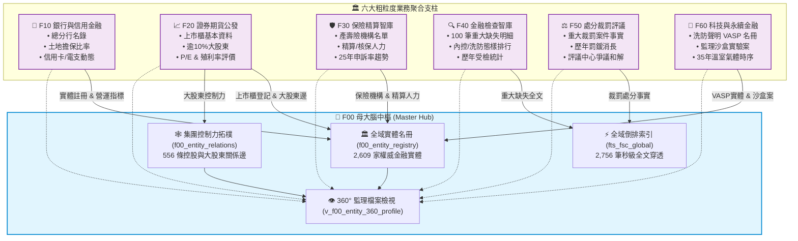
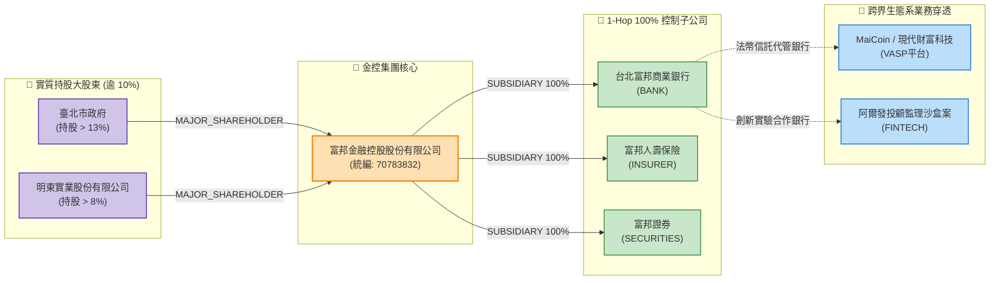
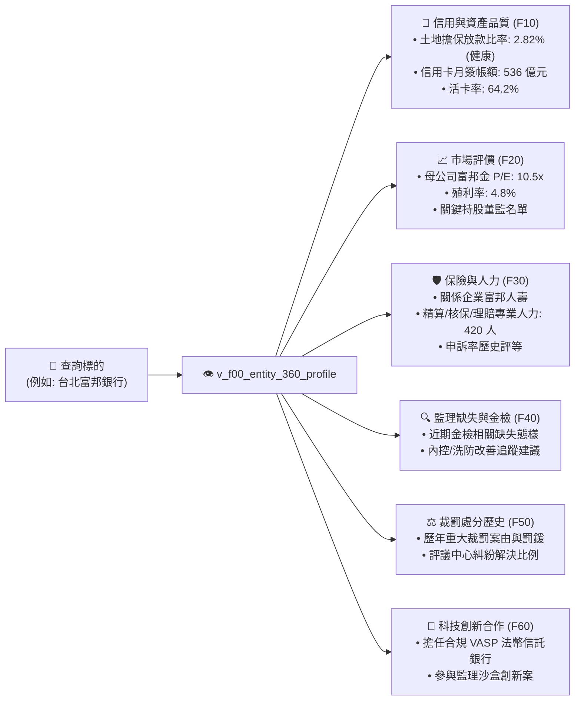

# 第 2 章：F00 母大腦全景架構與金融知識體系解構

> 🎯 **本章核心使命**：以全景視覺化架構圖（Mermaid 圖解）為核心，深入淺出地解開 `tw-fsc-db` 是如何將散落於銀行局、證期局、保險局、檢查局等互不相通的金融資料，透過「F00 母大腦中樞」融合成一張活生生的金融知識網路。同時提供 `fsc_cli` 的 3 分鐘上手實戰指南，讓讀者在最短時間內親身體驗資料穿透的威力。

---

## 2.1 跨子模組大一統架構全景圖 (Fig 2.1)

在傳統思維下，若要整合多個局處的資料庫，往往會嘗試將數十張表強行合併成一張龐大而脆弱的「巨型大寬表」，或是建立多個獨立資料庫彼此互不往來。

`tw-fsc-db` 採取了截然不同的軟體工程架構：**「實體資料庫集中單一、業務命名空間隔離、母大腦居中倒排穿透」**。所有資料存放於單一 SQLite 資料庫（`fsc.db`），以模組代號（`f10_*` 至 `f60_*`）保障資料表的業務純粹性；同時，由頂層的 **F00 母大腦 (Master Hub)** 扮演指揮官，透過全域實體名冊、控制力拓樸邊與倒排索引，無縫連通六大業務支柱。



**【架構核心特徵】**：
1. **單一真實身分證 (Single Truth Identifier)**：全系統嚴格以**台灣 8 碼公司統一編號 (Tax ID)** 作為實體跨模組穿透的唯一外鍵錨點。
2. **零阻礙即時聯動**：當使用者查詢富邦金控時，母大腦能同時自 F10 抓取其台北富邦銀行的放款活卡率、自 F20 抓取富邦證券的市場評價、自 F30 抓取富邦人壽的精算人力、自 F50 撈取金管會近年的裁罰紀錄，完全不需手動寫四次跨庫 JOIN。

---

## 2.2 全島 2,609 家金融實體名冊與別名消歧義地圖

金融資料整合最棘手的問題之一，就是「同一家機構在不同地方叫不同名字」：
- 在銀行局報表中，它叫「台北富邦商業銀行股份有限公司」；
- 在信用卡統計中，它叫「台北富邦銀行」；
- 在消費者評議中，民眾填寫「北富銀」；
- 在外商機構方面，更是充斥著中英文夾雜（例如「美商花旗銀行台北分行」與「Citibank N.A. Taipei Branch」）。

F00 母大腦建立的 `f00_entity_registry`，收錄全島 **2,609 家** 權威特許實體，建立了雙層消歧義對齊機制：

| 實體類別程式碼 (`entity_type`) | 涵蓋機構範疇 | 實體數量 | 關鍵對照特徵 |
| :--- | :--- | :--- | :--- |
| `FHC` (金融控股公司) | 台灣 14 家上市金控集團 | 14 家 | 擁有集團旗下所有特許牌照之控制權 |
| `BANK` (商業銀行) | 本國銀行、外商銀行台北分行、企銀 | 71 家 | 連結營業執照、金融機構總代號 |
| `LISTED_CO` (上市櫃企業) | 台灣證券交易所與櫃買中心掛牌企業 | 1,822 家 | 股票程式碼 (4碼)、產業分類、發行股數 |
| `INSURER` (產險與壽險) | 本國壽險、產險、再保險與外商分公司 | 52 家 | 業務員登錄數、精算核保人員名冊 |
| `VASP` (虛擬通貨平台) | 完成金管會洗防法遵聲明之合規業者 | 4 家 | 交易所品牌名、法幣信託代管商業銀行 |
| `OTHER` (創投/證券/大股東) | 經主管機關登記或持有關鍵金融股權者 | 646 家 | 董監持股、金控轉投資之投資公司 |

透過這張全域實體名冊，任何模糊字串（無論是打「國泰」、「世華」還是統編「16087528」）都能在毫秒之內精準錨定到唯一的主檔實體。

---

## 2.3 集團控制力與 1-Hop / 2-Hop 股權網路拓樸圖 (Fig 2.2)

「誰才是背後真正的老闆？」是金融監理與信用徵信永恆的靈魂拷問。

傳統報表只揭露直屬母公司，但現代金融帝國往往透過層層投資公司、境外控股、家族信託進行交叉持股。F00 母大腦的 `f00_entity_relations` 表，具體落盤了 **556 條** 實質控制力與股權關係邊：
- **`SUBSIDIARY` (全資/控制性子公司)**：金控集團對銀行、證券、壽險的 100% 股權掌控；
- **`MAJOR_SHAREHOLDER` (關鍵實質大股東)**：持有上市櫃金融或實體企業股份超過 10% 之法人或重要投資機構。



**【拓樸圖解業務價值】**：
當執法單位或徵信主管調閱特定交易所（如 MaiCoin）時，透過系統不僅能看見這家交易所的法規遵循狀態，還能沿著拓樸邊向外跳躍（Hop）：
1. **1-Hop**：發現其指定之法幣代管信託帳戶設於「台北富邦商業銀行」；
2. **2-Hop**：自動回溯該銀行隸屬於「富邦金控」，並展現其母公司股權結構與近年重大裁罰。
過去需要數週公文往返的資訊壁壘，在拓樸圖譜下一覽無遺。

---

## 2.4 360° 全景監理檔案透視檢視 (Fig 2.3)

為了解決各局處資訊割裂的痛苦，F00 打造了統一的檢視：`v_f00_entity_360_profile`。它就像一位 24 小時線上的虛擬調查員，當您給予一個機構統編，它會主動穿透所有模組，萃取該實體的「體質健檢總表」：



這種 360 度的全景檢視，徹底終結了金融徵信「瞎子摸象」的窘境。

---

## 2.5 底層資料庫轉換邏輯與指標計算原則

為了讓非工程背景的金融分析師與法遵主管也能完全信賴本智庫的資料品質，本專案將所有常見的資料髒污清洗與核心指標計算，全部以標準化規則下沉至資料庫引擎中：

1. **民國年到 ISO-8601 標準化 (`ROC_TO_ISO`)**：
   台灣官方資料最常出現「113/08/22」、「1130822」甚至「113.8.22」。系統內建萬用轉換引擎，一律於入庫時自動解析轉換為國際標準時序 `YYYY-MM-DD`，確保時間軸排序 100% 精準。
2. **千分位與字串數值安全解析 (`PARSE_NUM`)**：
   官方 CSV 中常出現「`1,234,567.89`」或以「`-`」、「`*`」代表無資料。系統自動過濾所有格式雜質，轉為高精度浮點數，絕不因符號異常中斷計算。
3. **土地擔保融資警戒指標 (Mortgage Risk Badge)**：
   依據《銀行法》第 72 條之 2 規定（商業銀行辦理住宅建築及企業建築放款之總額，不得超過放款時所收存款總餘額及金融債券發售額之和之 30%）。系統將土地擔保融資比率自動分級：
   - 🟢 **NORMAL (安全)**：比率 < 28.0%
   - 🟡 **WATCH (預警)**：28.0% ~ 28.5%
   - 🔴 **ALERT (警戒)**：> 28.5%
4. **信用卡動態活卡率 (Active Card Ratio)**：
   計算公式：$$\text{活卡率} = \frac{\text{有效卡數 (過去 6 個月內有消費紀錄)}}{\text{流通卡數}} \times 100\%$$
   精確反映發卡機構的真實顧客黏著度，而非虛胖的發卡數字。

---

## 2.6 `fsc_cli` 命令列工具快速上手與端到端實戰指南

為了讓大家不需要撰寫 SQL 語法就能立即調用整套智庫，我們打造了符合 **CLI Governance Spec (CGS) v2.1** 規範的官方工具：`fsc_cli.py`（簡稱 `fsc`）。

以下帶您在 3 分鐘內完成環境配置與端到端實戰：

### 1. 執行環境與三秒啟動
本專案支援**四階資料庫路徑自動尋標**。只要您的外接擴充磁碟（`/Volumes/D2024/...`）已掛載，或專案目錄下有資料庫，指令會自動抓取，完全不需手動配置路徑：

```bash
# 切換至子模組目錄
cd events-2026Q3/fsc-db-in/tw-fsc-db

# 執行狀態檢查看板
python src/cli/fsc_cli.py status
```

### 2. `fsc status`：一秒掌握全島監理態勢
指令會即時連線資料庫，輸出全島特許機構註冊與真值資料統計：

```text
================================================================================
📊 金管會開放資料智庫 (tw-fsc-db / GOV-A21) 運作狀態看板
================================================================================
• 主管機關：金融監督管理委員會 (OID: 2.16.886.101.20003.20022)
• 生效資料庫：/Volumes/D2024/data/fsc-db-in/tw-fsc-db/db/fsc.db (外接儲存裝置直連)
• 權威實體主冊：2,609 家 (金控 14 / 銀行 71 / 上市櫃 1,822 / 保險 52 / VASP 4)
• 控制力拓樸邊：556 條實質關係
• 全域倒排索引：2,756 筆可檢索專案
• 真實地面資料：18,624 筆 (100% 杜絕純範例假資料)
================================================================================
```

### 3. 全域搜尋與穿透檢索 (`fsc search`)
無論您手邊只有統編、公司名稱片段、或是想查特定違規態樣，輸入即可跨模組秒級穿透：

```bash
# 範例 A: 查詢「富邦」
python src/cli/fsc_cli.py search "富邦" --limit 5

# 範例 B: 查詢重大缺失包含「洗錢防制」之紀錄
python src/cli/fsc_cli.py search "洗錢防制" --limit 5
```

### 4. 360° 實體透視檔案 (`fsc profile`)
只要給予統編或機構名稱，一鍵印出 360 度全景監理體檢表：

```bash
python src/cli/fsc_cli.py profile "台北富邦"
```
*(終端將整齊呈現該銀行的存款規模、放款比率、信用卡月簽帳、所屬金控、近期裁罰與合作沙盒實驗案)*

### 5. 集團控制力網路展開 (`fsc relations`)
想查清集團底細或特定上市公司的大股東名冊？

```bash
# 展開富邦金控旗下所有子公司
python src/cli/fsc_cli.py relations "富邦金融控股"

# 展開台積電持有逾 10% 之關鍵大股東名冊
python src/cli/fsc_cli.py relations "台灣積體電路製造"
```

### 6. Pipeline 友善輸出 (`-j / --json`)
若您需要將查詢結果傳遞給下游 Python 腳本或 `jq` 進行二次處理，只要加上 `-j` 參數，所有日誌自動導向 `stderr`，`stdout` 僅輸出標準乾淨的 JSON：

```bash
# 取得 JSON 格式並用 jq 篩選
python src/cli/fsc_cli.py search "國泰" -j | jq '.results[0]'
```

---

掌握了 F00 母大腦的架構哲學與 CLI 工具後，從下一章開始，我們將逐一進入六大子模組的引擎室，深度解析每個金融業務領域的資料結構與實戰價值。
