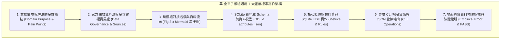

# 📘 3.0 全章子模組撰寫規範與通用 7 大維度架構說明 (03_00_structure_guide.md)

* **專案名稱**：`tw-fsc-db` (台灣金融監督管理開放資料智庫)
* **行政院部會代號**：`GOV-A21`
* **受控版本**：`v1.0.0`
* **歸檔位置**：`events-2026Q3/fsc-db-in/tw-fsc-db/book/03_00_structure_guide.md`
* **系統工程對齊**：[data_schema.md](../sys_eng/03_design/data_schema.md) | [test_plan.md](../sys_eng/05_verification_testing/test_plan.md)

---

## 🎯 3.0.1 第 3 章資料資產百科圖鑑整體定位

第 3 章是全書最核心的 **「六大金融領域知識資產與 DB 百科圖鑑 (Submodules Atlas)」**。

金融資料具備極高的專業度、法規嚴密性與複雜的實體關聯。為了徹底避免傳統技術檔案「只貼冷冰冰的 SQL 欄位、缺乏金融業務情境」的通病，本章採取**「每個子模組獨立成篇」**的深核寫作架構（`03_10_f10_banking_credit_db.md` 至 `03_60_f60_fintech_vasp_db.md`）。

全章六大子模組檔案，均嚴格遵循以下 **「通用 7 大維度標準架構」**，將靜態資料表昇華為具備解決實務難題能力的金融知識資產：

*Fig 3.0: 金融子模組通用 7 大維度標準寫作架構圖*

---

## 📐 3.0.2 通用 7 大維度標準寫作規範細節

全章六大子模組在撰寫專屬篇章時，均強制包含以下 7 大維度實質內容：

### 1. 業務情境與解決的金融痛點 (Domain Purpose & Pain Points)
* 解構該業務領域（如銀行放款、證券估值、保險精算、金檢缺失、裁罰評議、虛擬資產）的核心監理邏輯。
* 說明該模組具體為法遵主管、風控人員、投資人或執法檢警解決了什麼實務上的盲點。

### 2. 官方開放資料源與金管會權責局處 (Data Governance & Sources)
* 標明資料集名稱、官方下載 URL、格式（CSV/JSON）與更新頻率。
* 明確歸屬金管會業務局處（銀行局、證券期貨局、保險局、檢查局、法律事務處）或周邊機構（評議中心、櫃買中心、證交所）。
* **【強制附加本機 Samples 範例資料檔案連結】**：在資料源清單中，必須明確提供指向本機 `data/samples/` 的真實範例檔案連結（如 `[f10_fhc_setup_sample.csv](../data/samples/f10_fhc_setup_sample.csv)`），便於讀者直接點擊查閱微型真值資料。

### 3. 跨模組對接拓樸與資料流向 (Cross-Module Topology)
* **【強制配置專屬 `Fig 3.x` Mermaid 架構圖】**：清晰繪製該模組如何與頂層 F00 母大腦連線，以及如何與其他相鄰 2~3 個業務模組進行資料流動與穿透聯防。

### 4. SQLite 資料庫 Schema 與資料模型 (Data Model & Schema)
* 列出該模組之實體資料表、索引、與業務專屬 SQL View。
* 附上完整 SQL `CREATE TABLE` DDL 語法、主鍵與外鍵關聯。
* **【必須包含 `attributes_json` 規格定義】**：說明動態擴充欄位的 JSON Key-Value 結構。
* **【必須包含一筆真實資料列展示】**：展現 100% 地面真實資料的真實面貌。

### 5. 核心監理指標計算與 SQLite UDF 實作 (Metrics & Rules)
* 詳述該模組獨有的金融指標計算公式（如 F10 土地擔保放款警戒比率、信用卡活卡率；F20 本益比與殖利率；F30 爭議申訴率；F40 缺失頻次；F50 罰鍰消長；F60 溫室氣體時序）。
* 說明底層所調用的 SQLite 原生 UDF 函數（`ROC_TO_ISO`, `PARSE_NUM`, `RISK_BADGE`, `VALID_TAX_ID`）。

### 6. 專屬 CLI 指令實戰與 JSON 管線輸出 (CLI Operations)
* 列出該模組在 `fsc_cli.py` 中的專屬子命令與參數用法。
* 提供終端美化輸出（Rich Table）與乾淨的 JSON Payload 範例。

### 7. 地面真實資料物理指標與驗證證明 (Empirical Proof & PASS)
* 揭露該模組在主資料庫中的實體入庫總筆數（如 F10 3,970筆、F20 9,737筆等），100% 杜絕假資料。
* 引用單元測試案例（如 `test_f10.py` 至 `test_f60.py`）之 100% 綠燈 PASS 證明。

---

## 🗺️ 3.0.3 六大垂直子模組篇章索引地圖

| 篇章編號 | 業務模組代號與完整名稱 | 專屬獨立檔案 | 涵蓋核心資料集範疇 |
| :--- | :--- | :--- | :--- |
| **3.10** | **`F10` 銀行機構、信用金融與消費金融智庫** | [03_10_f10_banking_credit_db.md](./03_10_f10_banking_credit_db.md) | 銀行總分行、外銀在臺分行、金控設立、土地擔保融資、信用卡月簽帳、電支機構 |
| **3.20** | **`F20` 證券期貨、上市櫃公發市場與產業估值智庫** | [03_20_f20_securities_markets_db.md](./03_20_f20_securities_markets_db.md) | 上市公司名冊、上櫃公司名冊、重大股東持股逾10%、市場評價 (P/E & 殖利率)、期貨商據點 |
| **3.30** | **`F30` 保險市場、精算核保人力與特別補償智庫** | [03_30_f30_insurance_actuarial_db.md](./03_30_f30_insurance_actuarial_db.md) | 產壽險機構名錄、內外勤業務人力、精算/核保/理賠專業人力、25年保險申訴率趨勢、汽車特別補償基金 |
| **3.40** | **`F40` 金融檢查智庫與重大缺失全文檢索系統** | [03_40_f40_inspection_bureau_db.md](./03_40_f40_inspection_bureau_db.md) | 100筆重大缺失明細、處分法條對照、FTS5 全文倒排表、歷年受檢機構檢查次數統計 |
| **3.50** | **`F50` 法律事務、處分裁罰與金融消費評議智庫** | [03_50_f50_sanctions_legal_db.md](./03_50_f50_sanctions_legal_db.md) | 重大裁罰案件全文、歷年罰鍰總額統計、評議中心四大領域爭議統計與駁回和解率 |
| **3.60** | **`F60` 金融科技創新、VASP 虛擬通貨與永續金融智庫** | [03_60_f60_fintech_vasp_db.md](./03_60_f60_fintech_vasp_db.md) | 完成洗防聲明 VASP 業者、金管會監理沙盒創新實驗案、35年國家溫室氣體毛排放與淨排放 |

---

有了這套嚴謹的 7 大維度規範，下一節我們將正式進入 **3.10 F10 銀行機構、信用金融與消費金融智庫** 的實體獨立專篇！
