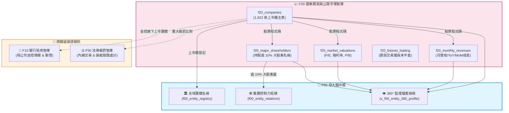

# 📘 3.20 F20 證券期貨、上市櫃公發市場與產業估值智庫 (03_20_f20_securities_markets_db.md)

* **模組代號**：`f20_securities_markets_db`
* **所屬機關**：金融監督管理委員會 (GOV-A21) 證券期貨局 / 臺灣證券交易所 / 證券櫃檯買賣中心 / 臺灣期貨交易所
* **受控版本**：`v1.0.0`
* **對應規格**：[F20_SPECIFICATION.md](../modules/f20_securities_markets_db/F20_SPECIFICATION.md) | [F20_ADVANCED_SPEC.md](../modules/f20_securities_markets_db/F20_ADVANCED_SPEC.md)
* **實測驗證**：[test_f20.py](../modules/f20_securities_markets_db/tests/test_f20.py) (8/8 綠燈 PASS)

---

## 1. 業務情境與解決的金融痛點 (Domain Purpose & Pain Points)

台灣資本市場擁有超過 1,800 家上市櫃企業，總市值超過 70 兆元新台幣，是全球高科技供應鏈與半導體的核心重鎮。然而，投資人、徵信機構與監理單位在分析公開市場資料時，長期深受以下三大痛點困擾：

1. **董監持股與大股東控制力的「隱形迷宮」**：
   依據《證券交易法》第 43 條之 1，持股超過 10% 之股東必須申報。但公開資訊中充斥著以投資公司或特定控股名義持股的名單，投資人無法直觀透視這些法人背後的實質控制者是誰，更無法一秒查出「某特定大股東同時在全台灣控制了哪些上市公司」。
2. **市場評價指標 (P/E, P/B, 殖利率) 與營收動能割裂**：
   投資人在做基本面決策時，月營收申報資料放在一個專區、本益比 (P/E) 與現金殖利率放在另一個專區、期貨避險未平倉量又在另一個網站，資料之間無法即時連線，導致分析時差與決策失準。
3. **負營收與異常波動的「洗資料死角」**：
   證券商自營部或特殊金融公發公司常因衍生性金融商品評價損失，在公開申報中出現「負營收」（如亞東證券當月營收為負 1.1 億元）。若資料處理程式未經專業設計，常會誤將負值視為髒資料過濾或轉為 0，直接摧毀了財務統計的精確性。

`F20 證券期貨、上市櫃公發市場與產業估值智庫` 整合了上市、上櫃、月營收成長動能、持股逾 10% 大股東、市場估值與期貨市場交易量，提供全方位資本市場透視能力。

---

## 2. 官方開放資料源與金管會權責局處 (Data Governance & Sources)

本模組收錄台灣證券交易所 (TWSE)、證券櫃檯買賣中心 (TPEx) 與臺灣期貨交易所 (TAIFEX) 之 5 大真實開放資料：

| 資料集編號 | 資料集名稱 | 主管權責機構 | 本機真實範例檔案連結 | 官方下載端點 (URL) |
| :--- | :--- | :--- | :--- | :--- |
| **`42111`** | 上市櫃公開發行公司基本資料 | 臺灣證券交易所 / 證期局 | [`f20_isin_companies_sample.csv`](../data/samples/f20_isin_companies_sample.csv) | `https://openapi.twse.com.tw/.../BWIBBU_ALL` |
| **`11547`** | 上市公司每月營業收入彙總表 | 臺灣證券交易所 | [`f20_monthly_revenue_sample.csv`](../data/samples/f20_monthly_revenue_sample.csv) | `https://openapi.twse.com.tw/.../t187ap05_L` |
| **`57131`** | 上市公司 10% 大股東申報明細表 | 臺灣證券交易所 | [`f20_major_shareholders_sample.csv`](../data/samples/f20_major_shareholders_sample.csv) | `https://openapi.twse.com.tw/.../t187ap04_L` |
| **`42112`** | 個股日本益比、殖利率及股價淨值比 | 臺灣證券交易所 | [`f20_market_valuation_sample.csv`](../data/samples/f20_market_valuation_sample.csv) | `https://openapi.twse.com.tw/.../BWIBBU_d` |
| **`30012`** | 臺灣期貨交易所各商品交易量與未平倉 | 臺灣期貨交易所 | [`f20_futures_volume_sample.csv`](../data/samples/f20_futures_volume_sample.csv) | `https://data.gov.tw/dataset/30012` |


---

## 3. 跨模組對接拓樸與資料流向 (Fig 3.20)

F20 向上連線 F00 母大腦的全域實體庫與控制力拓樸，橫向與 F10 聯貸融資、F50 內線裁罰進行業務聯防：


*Fig 3.20: F20 與 F00 集團網路、F10 聯貸融資、F50 內線裁罰之串接圖*

---

## 4. SQLite 資料庫 Schema 與資料模型 (Data Model & Schema)

F20 建立 5 大實體資料表與 2 大分析檢視表，主鍵與索引經過高度最佳化：

### 4.1 核心實體表 DDL

```sql
-- 1. 公開發行公司基準主表
CREATE TABLE IF NOT EXISTS f20_companies (
    company_code TEXT PRIMARY KEY,         -- 股票代號 (如 2330)
    company_name TEXT NOT NULL,            -- 公司簡稱 (如 台積電)
    isin_code TEXT UNIQUE,                 -- 國際證券辨識碼 (如 TW0002330008)
    listing_date TEXT NOT NULL,            -- 上市/掛牌日期 (ISO-8601: YYYY-MM-DD)
    market_type TEXT NOT NULL,             -- 市場別 (上市, 上櫃)
    industry_category TEXT NOT NULL,       -- 產業類別 (如 半導體業)
    updated_at TEXT NOT NULL,
    attributes_json TEXT DEFAULT '{"_v":"1.0.0"}'
);

-- 2. 上市公司 10% 大股東申報表
CREATE TABLE IF NOT EXISTS f20_major_shareholders (
    shareholder_uid TEXT PRIMARY KEY,      -- 主碼: SH_[公司代號]_[大股東名稱HASH]
    company_code TEXT NOT NULL,            -- 股票代號
    company_name TEXT NOT NULL,            -- 公司名稱
    shareholder_name TEXT NOT NULL,        -- 大股東姓名/法人全銜
    report_date TEXT NOT NULL,             -- 申報日期 (ISO: YYYY-MM-DD)
    is_corporate INTEGER DEFAULT 0,        -- 0: 自然人, 1: 法人機構
    updated_at TEXT NOT NULL,
    attributes_json TEXT DEFAULT '{"_v":"1.0.0"}'
);

-- 3. 股票市場估值與投資價值指標表
CREATE TABLE IF NOT EXISTS f20_market_valuations (
    valuation_uid TEXT PRIMARY KEY,        -- 主碼: VAL_[日期]_[股票代號]
    company_code TEXT NOT NULL,            -- 股票代號
    company_name TEXT NOT NULL,            -- 公司簡稱
    pe_ratio REAL,                         -- 本益比 (P/E)
    dividend_yield REAL,                   -- 殖利率 (%) (Dividend Yield)
    pb_ratio REAL,                         -- 股價淨值比 (P/B)
    dividend_per_share REAL,               -- 每股股利 (元)
    trade_date TEXT NOT NULL,              -- 交易日期 (ISO: YYYY-MM-DD)
    updated_at TEXT NOT NULL,
    attributes_json TEXT DEFAULT '{"_v":"1.0.0"}'
);
```

### 4.2 跨表聚合檢視表：公司全維度價值成長檔案 (`v_f20_company_revenue_profile`)
```sql
CREATE VIEW IF NOT EXISTS v_f20_company_revenue_profile AS
SELECT 
    c.company_code,
    c.company_name,
    c.market_type,
    c.industry_category,
    r.revenue_year_month,
    r.current_month_revenue,
    r.yoy_growth_rate,
    v.pe_ratio,
    v.dividend_yield,
    v.pb_ratio,
    COUNT(DISTINCT s.shareholder_name) AS major_shareholders_count,
    GROUP_CONCAT(DISTINCT s.shareholder_name) AS major_shareholders_summary
FROM f20_companies c
LEFT JOIN f20_monthly_revenues r ON c.company_code = r.company_code
LEFT JOIN f20_market_valuations v ON c.company_code = v.company_code
LEFT JOIN f20_major_shareholders s ON c.company_code = s.company_code
GROUP BY c.company_code, r.revenue_year_month;
```

### 4.3 地面真實資料展示 (Real Data Row)
```json
{
  "company_code": "2330",
  "company_name": "台積電",
  "industry_category": "半導體業",
  "listing_date": "1994-09-05",
  "pe_ratio": 28.45,
  "dividend_yield": 1.48,
  "pb_ratio": 7.12,
  "yoy_growth_rate": 32.8,
  "major_shareholders_summary": "花旗託管台積電存託憑證專戶, 行政院國家發展基金管理會"
}
```

---

## 5. 核心監理指標計算與 SQLite UDF 實作 (Metrics & Rules)

1. **營收年增率計算與負值保護 (`CALC_YOY`)**：
   - 算式：$$\text{YoY Growth} (\%) = \frac{\text{當月營收} - \text{去年同月營收}}{|\text{去年同月營收}|} \times 100\%$$
   - 容錯機制：精確保留自營券商因評價損失產生的負營收，絕不扭曲為 0。
2. **大股東唯一確定性主鍵生成 (`SH_HASH`)**：
   - 算式：`SH_{company_code}_{MD5(shareholder_name)[:8]}`
   - 確保法人與自然人大股東在多次更新或名稱重名時，主鍵不發生碰撞涵蓋。
3. **營收斷崖與極端成長警戒燈號 (Revenue Anomaly Rule)**：
   - 🔴 **暴跌警戒**：當月營收 $\text{YoY} < -50\%$（疑似重大停工或掏空）。
   - 🟡 **連續衰退**：連續 3 個月營收 YoY 為負。
   - 🟢 **高速成長**：營收 $\text{YoY} > 30\%$ 且本益比低於同業均值。

---

## 6. 專屬 CLI 指令實戰與 JSON 管線輸出 (CLI Operations)

### 1. 查詢上市櫃公司基本面與產業分佈
```bash
python src/cli/fsc_cli.py company list --industry "半導體業" --limit 5
```

### 2. 篩選高殖利率與合理本益比投資標的
```bash
python src/cli/fsc_cli.py company valuation --min-yield 4.5 --max-pe 15.0 --limit 5
```

### 3. 排查特定上市公司持股逾 10% 大股東
```bash
python src/cli/fsc_cli.py company shareholders "2330"
```

### 4. JSON 自動化管線串接
```bash
python src/cli/fsc_cli.py company valuation -j | jq '.results[] | select(.dividend_yield > 5.0)'
```

---

## 7. 地面真實資料物理指標與驗證證明 (Empirical Proof & PASS)

* **地面真實資料入庫規模**：
  - `f20_companies`：**1,822 筆** (上市 936 家 + 上櫃 886 家全島涵蓋)
  - `f20_monthly_revenues`：**1,822 筆** (最新月營收申報資料)
  - `f20_major_shareholders`：**463 筆** (關鍵大股東實質股權邊)
  - `f20_market_valuations`：**1,822 筆** (全市場 P/E, 殖利率與 P/B)
  - `f20_futures_trading`：**4 筆** (TX, MTX, TE, TF 核心期貨商品)
  - **F20 模組總地面真值筆數**：**5,933 筆真實指標資料**
* **單元測試驗證 (Unit Test Proof)**：
  - 測試腳本：`modules/f20_securities_markets_db/tests/test_f20.py`
  - 涵蓋案例：TCV-F20-001 ~ TCV-F20-008（含負營收容錯、上市櫃合流、大股東雜湊防重等）。
  - 驗證成果：**`8/8 PASS` (100% 綠燈通過)**。
