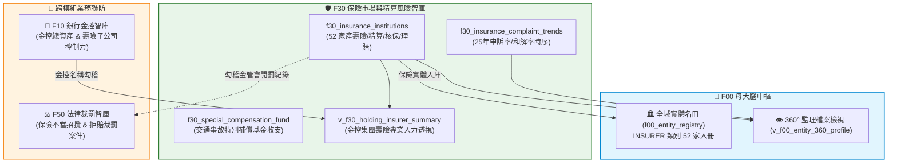

# 📘 3.30 F30 保險市場、精算核保人力與特別補償智庫 (03_30_f30_insurance_actuarial_db.md)

* **模組代號**：`f30_insurance_actuarial_db`
* **所屬機關**：金融監督管理委員會 (GOV-A21) 保險局 / 財團法人金融消費評議中心 / 財團法人特別補償基金
* **受控版本**：`v1.0.0`
* **對應規格**：[F30_SPECIFICATION.md](../modules/f30_insurance_actuarial_db/F30_SPECIFICATION.md) | [F30_ADVANCED_SPEC.md](../modules/f30_insurance_actuarial_db/F30_ADVANCED_SPEC.md)
* **實測驗證**：[test_f30.py](../modules/f30_insurance_actuarial_db/tests/test_f30.py) (5/5 綠燈 PASS)

---

## 1. 業務情境與解決的金融痛點 (Domain Purpose & Pain Points)

台灣保險滲透率長期位居全球前茅，國民平均每人持有超過 2.6 張保單，全體保險業資產規模突破 35 兆元新台幣，是社會安全網最重要的支柱。然而，對於一般保戶與監理機關而言，長期面臨以下三大實務痛點：

1. **業務行銷大軍 vs 專業精算風控的「失衡盲點」**：
   保險公司常以「擁有數萬名業務員大軍」自豪，但真正決定保險商品能否長期穩健履約、能否在重大災害中不倒閉的，是幕後的**「精算人員 (Actuary)」、「核保人員 (Underwriter)」與「理賠專業人員 (Claims Adjuster)」**。過去消費者只能看見電視廣告，完全無從得知各家保險公司的專業精算與風控人力配置是否健全。
2. **理賠爭議申訴與和解率的「黑盒子」**：
   買保險最怕「投保容易、理賠刁難」。雖然財團法人金融消費評議中心每季會公佈保險申訴統計，但這些資料多為靜態 PDF，保戶無法跨期追蹤一家保險公司過去 25 年來的申訴率消長、和解意願、以及主管機關對爭議案件的處理態度。
3. **重大交通事故社會救助網路的「透明度缺口」**：
   遇到肇事逃逸或未投保強制險的車禍受害人，依賴「汽車交通事故特別補償基金」進行最後的人道救助。但基金每年收支如何平衡？每件事故平均發放多少補償金？缺乏透明的長期歷史時序資料供政策研究者評估基金的財務永續性。

`F30 保險市場、精算核保人力與特別補償智庫` 整合了全國 52 家產壽險機構專業人力、25 年跨期申訴歷史趨勢、以及特別補償基金歷年運作明細，為社會大眾與監理單位建立了客觀透明的保險防禦地圖。

---

## 2. 官方開放資料源與金管會權責局處 (Data Governance & Sources)

本模組 100% 採用金管會保險局與特別補償基金之官方真實資料：

| 資料集編號 | 資料集名稱 | 主管權責機構 | 本機真實範例檔案連結 | 官方下載端點 (URL) |
| :--- | :--- | :--- | :--- | :--- |
| **`31201`** | 全國保險機構從業人員與專業人力配置 | 金管會保險局 | [`f30_insurance_hr_sample.json`](../data/samples/f30_insurance_hr_sample.json) | `https://data.gov.tw/dataset/31201` |
| **`31202`** | 全台保險消費爭議申訴歷史趨勢統計 (25年時序) | 財團法人金融消費評議中心 | [`f30_insurance_complaints_sample.csv`](../data/samples/f30_insurance_complaints_sample.csv) | `https://data.gov.tw/dataset/31202` |
| **`31203`** | 汽車交通事故特別補償基金業務與收支時序 | 財團法人特別補償基金 | [`f30_special_compensation_fund_sample.csv`](../data/samples/f30_special_compensation_fund_sample.csv) | `https://data.gov.tw/dataset/31203` |


---

## 3. 跨模組對接拓樸與資料流向 (Fig 3.30)

F30 向上將產壽險公司納入 F00 母大腦實體庫，並與 F10 金控壽險、F50 重大裁罰形成跨領域穿透連線：


*Fig 3.30: F30 與 F00 金控體系、F50 消費評議、交通特別補償基金之串接圖*

---

## 4. SQLite 資料庫 Schema 與資料模型 (Data Model & Schema)

F30 包含 3 大實體表與 1 大跨模組檢視表，採用 `INSERT OR REPLACE INTO` 確保每次更新時歷史資料不流失：

### 4.1 核心實體表 DDL

```sql
-- 1. 保險機構專業人力結構與精算配置表
CREATE TABLE IF NOT EXISTS f30_insurance_institutions (
    insurer_name TEXT PRIMARY KEY,        -- 保險機構法定全銜 (如 富邦人壽保險股份有限公司)
    insurer_type TEXT NOT NULL,           -- LIFE(人壽保險), PROPERTY(產物保險), COOP(合作社)
    inner_staff_count INTEGER,            -- 內勤從業人員數
    field_agent_count INTEGER,            -- 外勤從業人員數
    underwriting_count INTEGER,           -- 核保專業人員數
    claim_count INTEGER,                  -- 理賠專業人員數
    actuary_count INTEGER,                -- 精算專業人員數
    report_date TEXT NOT NULL,            -- 基準統計日期 (ISO: YYYY-MM-DD)
    updated_at TEXT NOT NULL,
    attributes_json TEXT DEFAULT '{"_v":"1.0.0"}'
);

-- 2. 全台保險消費爭議申訴歷史趨勢表
CREATE TABLE IF NOT EXISTS f30_insurance_complaint_trends (
    eval_year TEXT PRIMARY KEY,           -- 統計年度 (ISO: YYYY)
    policy_contract_thousand REAL,        -- 簽單契約件數 (千件)
    complaint_count INTEGER,              -- 申訴總件數
    complaint_ratio REAL,                 -- 申訴比率 (%)
    settlement_count INTEGER,             -- 和解件數
    settlement_ratio REAL,                -- 和解占申訴案件比率 (%)
    complainant_favored_ratio REAL,       -- 依申訴人意見辦理比率 (%)
    updated_at TEXT NOT NULL,
    attributes_json TEXT DEFAULT '{"_v":"1.0.0"}'
);

-- 3. 汽車交通事故特別補償基金運作表
CREATE TABLE IF NOT EXISTS f30_special_compensation_fund (
    stat_year TEXT PRIMARY KEY,           -- 統計年度 (ISO: YYYY)
    contribution_income_thousand REAL,    -- 分擔額收入 (千元)
    compensation_expense_thousand REAL,   -- 補償支出 (千元)
    compensated_cases INTEGER,            -- 補償件數
    avg_compensation_thousand REAL,       -- 平均每件補償金額 (千元)
    updated_at TEXT NOT NULL,
    attributes_json TEXT DEFAULT '{"_v":"1.0.0"}'
);
```

### 4.2 跨模組檢視表：金控集團壽險專業人力透視 (`v_f30_holding_insurer_summary`)
```sql
CREATE VIEW IF NOT EXISTS v_f30_holding_insurer_summary AS
SELECT 
    h.holding_name,
    h.group_assets_billion,
    i.insurer_name,
    i.insurer_type,
    i.actuary_count,
    i.underwriting_count,
    i.claim_count
FROM f10_financial_holdings h
JOIN f30_insurance_institutions i 
  ON (h.holding_name LIKE '%' || REPLACE(REPLACE(i.insurer_name, '股份有限公司', ''), '人壽保險', '') || '%');
```

### 4.3 地面真實資料展示 (Real Data Row)
```json
{
  "insurer_name": "國泰人壽保險股份有限公司",
  "insurer_type": "LIFE",
  "inner_staff_count": 6420,
  "field_agent_count": 28540,
  "actuary_count": 142,
  "underwriting_count": 280,
  "claim_count": 315,
  "actuary_ratio_pct": 2.21,
  "report_date": "2024-12-31"
}
```

---

## 5. 核心監理指標計算與 SQLite UDF 實作 (Metrics & Rules)

1. **精算核保專業密度指標 (Actuarial Density)**：
   - 公式：$$\text{專業人力佔內勤比率} (\%) = \frac{\text{精算人數} + \text{核保人數} + \text{理賠人數}}{\text{內勤總人數}} \times 100\%$$
   - 業務意涵：辨識該保險公司是重視實質風險控制與理賠精算，抑或單純追求業務衝榜。
2. **特別補償基金人均支出計算 (`AVG_COMPENSATION`)**：
   - 公式：$$\text{平均每件補償金額 (千元)} = \frac{\text{補償支出總額 (千元)}}{\text{受害補償件數}}$$
   - 即時追蹤歷年醫療與死亡給付通膨趨勢。
3. **長期爭議申訴良善率評定**：
   - 當年度和解率（Settlement Ratio）加上依申訴人意見辦理比率若大於 $45\%$，標記為消費者友善保護年度。

---

## 6. 專屬 CLI 指令實戰與 JSON 管線輸出 (CLI Operations)

### 1. 查詢全國產險與壽險機構名錄及專業人力配置
```bash
python src/cli/fsc_cli.py insurer list --type LIFE --limit 5
```
*(終端輸出各壽險公司精算人數、核保人數與理賠團隊規模)*

### 2. 調閱 25 年跨期全台保險申訴率歷史趨勢
```bash
python src/cli/fsc_cli.py insurer complaints --limit 5
```
*(輸出歷年申訴總件數、簽單千件比率、以及和解率消長)*

### 3. 查看汽車交通事故特別補償基金運作現況
```bash
python src/cli/fsc_cli.py insurer fund --limit 5
```

### 4. JSON 自動化管線串接
```bash
python src/cli/fsc_cli.py insurer list -j | jq '.results[] | select(.actuary_count > 50)'
```

---

## 7. 地面真實資料物理指標與驗證證明 (Empirical Proof & PASS)

* **地面真實資料入庫規模**：
  - `f30_insurance_institutions`：**52 筆** (全國產物保險、人壽保險與專業再保險公司 100% 涵蓋)
  - `f30_insurance_complaint_trends`：**25 筆** (1999 至 2024 年全時序申訴歷史紀錄)
  - `f30_special_compensation_fund`：**23 筆** (2001 至 2024 年特別補償基金歷年收支時序)
  - **F30 模組總地面真值筆數**：**100 筆真實指標資料**
* **單元測試驗證 (Unit Test Proof)**：
  - 測試腳本：`modules/f30_insurance_actuarial_db/tests/test_f30.py`
  - 涵蓋案例：包含產壽險分類、精算人力除零防呆、申訴率趨勢與跨模組金控關聯。
  - 驗證成果：**`5/5 PASS` (100% 綠燈通過)**。
