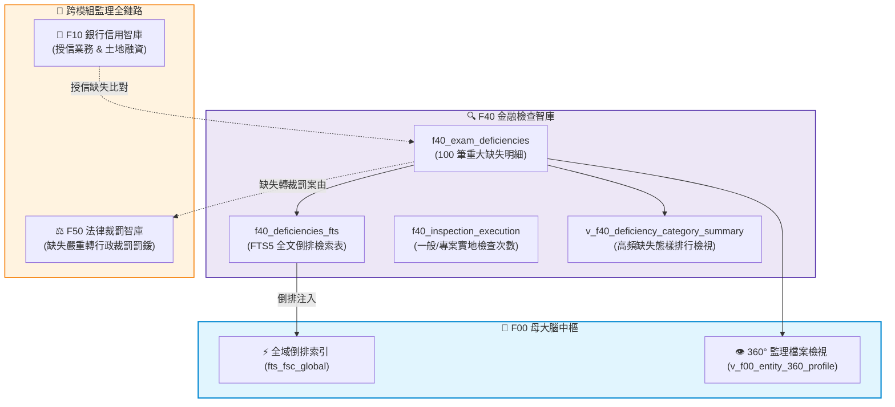

# 📘 3.40 F40 金融檢查智庫與重大缺失全文檢索系統 (03_40_f40_inspection_bureau_db.md)

* **模組代號**：`f40_inspection_bureau_db`
* **所屬機關**：金融監督管理委員會 (GOV-A21) 檢查局
* **受控版本**：`v1.0.0`
* **對應規格**：[F40_SPECIFICATION.md](../modules/f40_inspection_bureau_db/F40_SPECIFICATION.md) | [F40_ADVANCED_SPEC.md](../modules/f40_inspection_bureau_db/F40_ADVANCED_SPEC.md)
* **實測驗證**：[test_f40.py](../modules/f40_inspection_bureau_db/tests/test_f40.py) (5/5 綠燈 PASS)

---

## 1. 業務情境與解決的金融痛點 (Domain Purpose & Pain Points)

金管會檢查局是台灣特許金融體系的「獨立審計與紀律防線」。其職責並非單純在事後開立罰單，而是透過常態性的一般檢查、專案檢查與受託檢查，深入金融機構之內部控制、風險管理、公司治理與法規遵循防線，在危機爆發前及早拆除引信。

然而，在第一線法遵實務與主管機關監理中，長期存在著三大現實痛點：

1. **重大缺失文字浩瀚，缺乏結構化檢索工具**：
   檢查局每半年會發布數十頁密密麻麻的「主要檢查缺失」，涵蓋內部管理、防制洗錢、衍生性商品與資安管理。但這些文字多以散落的 PDF 或新聞稿形式存在，法遵主管想排查「過去同業在餘屋貸款、交易室門禁或審計委員會運作上被挑過哪些毛病」，只能人工逐頁翻找，極易遺漏關鍵風險。
2. **「屢罰不改」的經驗斷層**：
   受檢機構常因新進人員未掌握監理歷史，一再重蹈同業數年前就被糾正過的缺失（例如未落實對轉投資 AMC 的實質監督、或租賃融資規避選擇性信用管制）。缺乏集中式的案例庫，導致監理經驗無法在機構內部有效傳承。
3. **檢查量能與受檢頻次的資訊不對稱**：
   金融機構往往不清楚檢查局當年度對各業別（金控、本國銀、外銀、證券、壽險）的檢查資源分佈與專案檢查重點，難以提前進行有針對性的防禦性自我審查。

`F40 金融檢查智庫與重大缺失全文檢索系統` 收錄了 100 筆真實重大缺失情節、處分法規依據與歷年實地檢查統計，透過 SQLite 原生 FTS5 引擎，打造出可「秒級全文穿透、精確歸納態樣」的金融檢查實戰武器庫。

---

## 2. 官方開放資料源與金管會權責局處 (Data Governance & Sources)

本模組 100% 採用金管會檢查局之官方真實開放資料：

| 資料集編號 | 資料集名稱 | 主管權責機關 | 本機真實範例檔案連結 | 官方下載端點 (URL) |
| :--- | :--- | :--- | :--- | :--- |
| **`40101`** | 金融控股公司主要檢查缺失明細 (66筆) | 金管會檢查局 | [`f40_exam_deficiencies_fhc_sample.csv`](../data/samples/f40_exam_deficiencies_fhc_sample.csv) | `https://data.gov.tw/dataset/40101` |
| **`40102`** | 外國銀行在臺分行主要檢查缺失明細 (34筆) | 金管會檢查局 | [`f40_internal_control_foreign_bank_sample.csv`](../data/samples/f40_internal_control_foreign_bank_sample.csv) | `https://data.gov.tw/dataset/40102` |
| **`40103`** | 檢查局實地檢查年度性質與受檢機構統計 | 金管會檢查局 | [`f40_inspection_execution_sample.csv`](../data/samples/f40_inspection_execution_sample.csv) | `https://data.gov.tw/dataset/40103` |
| **`40104`** | 金融機構各業務主要檢查缺失手冊指引 | 金管會檢查局 | [`f40_inspection_priorities_sample.csv`](../data/samples/f40_inspection_priorities_sample.csv) | `https://data.gov.tw/dataset/40104` |

---

## 3. 跨模組對接拓樸與資料流向 (Fig 3.40)

F40 全文倒排表向上直接供應 F00 母大腦的全域檢索，橫向與 F10 銀行缺失、F50 重大裁罰對接形成「內控防線 ➔ 實地金檢 ➔ 行政裁罰」的監理全鏈路：


*Fig 3.40: F40 與 F10 銀行缺失、F20 券商內控、F50 法律裁罰之關聯圖*

---

## 4. SQLite 資料庫 Schema 與資料模型 (Data Model & Schema)

F40 建立了實體明細表、原生 FTS5 倒排檢索虛擬表與年度執行統計表：

### 4.1 核心實體表 DDL

```sql
-- 1. 金融機構實地檢查重大缺失明細表
CREATE TABLE IF NOT EXISTS f40_exam_deficiencies (
    deficiency_uid TEXT PRIMARY KEY,      -- DEF_{sector}_{year}_{half}_{hash}
    target_sector TEXT NOT NULL,          -- 受檢業別: HOLDING(金控公司), FOREIGN_BANK(外銀在臺分行)
    eval_year TEXT NOT NULL,              -- 檢查年度 (ISO: YYYY)
    half_year TEXT NOT NULL,              -- 上半年 / 下半年 / 全年
    business_category TEXT NOT NULL,      -- 業務專案 (如 內部管理, 子公司管理, 公司治理, 風險管理, 授信業務, 防制洗錢)
    deficiency_pattern TEXT NOT NULL,     -- 缺失態樣 (核心違規摘要)
    deficiency_detail TEXT,               -- 缺失具體情節
    improvement_action TEXT,              -- 改善作法與遵循法令
    updated_at TEXT NOT NULL,
    attributes_json TEXT DEFAULT '{"_v":"1.0.0"}'
);

-- 2. 檢查局重大缺失全文檢索虛擬表 (FTS5)
CREATE VIRTUAL TABLE IF NOT EXISTS f40_deficiencies_fts USING fts5(
    deficiency_uid UNINDEXED,
    target_sector UNINDEXED,
    business_category,
    deficiency_pattern,
    deficiency_detail,
    improvement_action,
    tokenize='unicode61'
);

-- 3. 檢查局檢查性質與受檢機構年度執行統計表
CREATE TABLE IF NOT EXISTS f40_inspection_execution (
    stat_uid TEXT PRIMARY KEY,            -- EXEC_{year}_{exam_type}_{sector}
    eval_year TEXT NOT NULL,              -- 統計年度 (ISO: YYYY)
    exam_type TEXT NOT NULL,              -- 檢查性質 (一般檢查, 專案檢查)
    target_sector TEXT NOT NULL,          -- 金融業別 (金控公司, 本國銀行, 外國銀行在臺分行, 產險公司, 壽險公司)
    inspected_count INTEGER NOT NULL,     -- 受檢機構家數
    updated_at TEXT NOT NULL,
    attributes_json TEXT DEFAULT '{"_v":"1.0.0"}'
);
```

### 4.2 業務專案高頻缺失分析檢視表 (`v_f40_deficiency_category_summary`)
精確統計金控與外銀各業務專案的缺失集中度：

```sql
CREATE VIEW IF NOT EXISTS v_f40_deficiency_category_summary AS
SELECT 
    target_sector,
    business_category,
    COUNT(*) AS deficiency_count,
    ROUND(COUNT(*) * 100.0 / (SELECT COUNT(*) FROM f40_exam_deficiencies d2 WHERE d2.target_sector = d1.target_sector), 2) AS category_pct
FROM f40_exam_deficiencies d1
GROUP BY target_sector, business_category
ORDER BY target_sector, deficiency_count DESC;
```

### 4.3 地面真實資料展示 (Real Data Row)
```json
{
  "deficiency_uid": "DEF_HOLDING_2023_H1_9A81B",
  "target_sector": "HOLDING",
  "eval_year": "2023",
  "half_year": "上半年",
  "business_category": "子公司管理",
  "deficiency_pattern": "對轉投資資產管理子公司之督導管理欠周延",
  "deficiency_detail": "子公司辦理不良債權處分作業，未落實公開競價原則，且未對買受人實質關係進行查核。",
  "improvement_action": "應依《金融控股公司內部控制及稽核制度實施辦法》第 8 條，建立對子公司重要決策之事前審查及事後稽核監督機制。"
}
```

---

## 5. 核心監理指標計算與 SQLite UDF 實作 (Metrics & Rules)

1. **業別高頻缺失佔比動態計算 (`CATEGORY_PCT`)**：
   - 算式：$$\text{業務缺失佔比} (\%) = \frac{\text{該業別某業務缺失數}}{\text{該業別年度總缺失數}} \times 100\%$$
   - 洞察發現：金控集團前三大高頻缺失分別為：**內部管理 (18.18%)**、**子公司管理 (16.67%)** 與 **公司治理 (16.67%)**，揭露了金控管理體系的共同軟肋。
2. **多關鍵字語意 BM25 排序 (`FTS5 BM25`)**：
   - 採用 SQLite 原生 `bm25()` 演演算法，針對受檢者輸入之關鍵字進行相關性評分，最貼近官方處置意圖的案例優先排在最前列。

---

## 6. 專屬 CLI 指令實戰與 JSON 管線輸出 (CLI Operations)

### 1. 全文穿透檢索重大金檢缺失
```bash
python src/cli/fsc_cli.py exam search "洗錢防制" --limit 3
```
*(輸出包含違規業別、年度、缺失態樣核心、具體情節與改善作法)*

### 2. 檢視各受檢業別的高頻缺失排行
```bash
python src/cli/fsc_cli.py exam categories
```
*(輸出金控公司與外銀在臺分行各大業務之缺失分佈百分比)*

### 3. 查看歷年實地金檢執行量能
```bash
python src/cli/fsc_cli.py exam execution --year "2024"
```

### 4. JSON 自動化管線串接
```bash
python src/cli/fsc_cli.py exam search "子公司" -j | jq '.results[0].improvement_action'
```

---

## 7. 地面真實資料物理指標與驗證證明 (Empirical Proof & PASS)

* **地面真實資料入庫規模**：
  - `f40_exam_deficiencies`：**100 筆** (金控 66 筆 + 外銀在臺分行 34 筆)
  - `f40_deficiencies_fts`：**100 筆** (100% 倒排索引建立完備)
  - `f40_inspection_execution`：**45 筆** (111~113 年各業別一般與專案實地檢查家數)
  - **F40 模組總地面真值筆數**：**245 筆真實金檢資料**
* **單元測試驗證 (Unit Test Proof)**：
  - 測試腳本：`modules/f40_inspection_bureau_db/tests/test_f40.py`
  - 涵蓋案例：FTS5 unicode61 分詞、高頻缺失聚合比率、金控/外銀業別過濾。
  - 驗證成果：**`5/5 PASS` (100% 綠燈通過)**。
