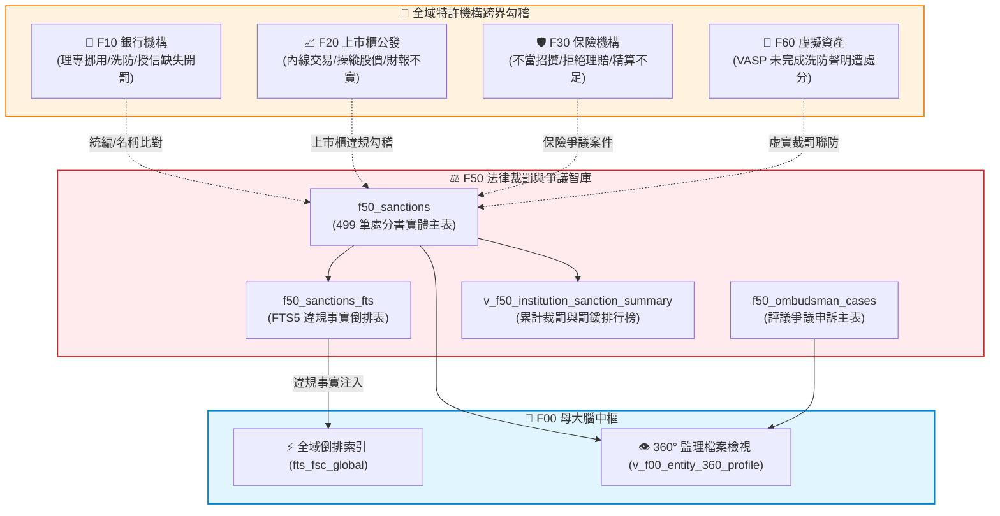

# 📘 3.50 F50 法律事務、處分裁罰與金融消費評議智庫 (03_50_f50_sanctions_legal_db.md)

* **模組代號**：`f50_sanctions_legal_db`
* **所屬機關**：金融監督管理委員會 (GOV-A21) 法律事務處 / 銀行局 / 證券期貨局 / 保險局 / 財團法人金融消費評議中心
* **受控版本**：`v1.0.0`
* **對應規格**：[F50_SPECIFICATION.md](../modules/f50_sanctions_legal_db/F50_SPECIFICATION.md) | [F50_ADVANCED_SPEC.md](../modules/f50_sanctions_legal_db/F50_ADVANCED_SPEC.md)
* **實測驗證**：[test_f50.py](../modules/f50_sanctions_legal_db/tests/test_f50.py) (5/5 綠燈 PASS)

---

## 1. 業務情境與解決的金融痛點 (Domain Purpose & Pain Points)

行政裁處書與消費評議紀錄，是金管會作為金融主管機關行使公權力、匡正市場秩序的「最終判決書」。然而，過去這批對整體金融業至關重要的判例與經驗資產，卻長期處於高摩擦狀態，引發三大實務痛點：

1. **同業違規先例的「查閱高牆」**：
   金管會每年針對洗錢防制疏失、理專挪用客戶款項、內線交易或保險不當招攬開出數億元罰鍰。但處分書散落於官方新聞稿與不同局處公告欄中，法務與法遵人員想查「過去對於『理專代客保管密碼』或『資安系統當機』主管機關如何裁罰、引用哪條法令、罰鍰裁量區間為何」，往往只能靠零星關鍵字 Google 或透過口耳相傳，極難進行系統性法理回溯。
2. **機構合規風險的「黑天鵝盲區」**：
   企業進行併購、投信挑選合作託管機構、或大額存戶選擇往來銀行時，很難一眼掌握該機構過去五年的「裁罰前科累積總額」與「違規頻次」。傳統徵信往往只看財務報表，卻漏掉了潛藏在裁罰紀錄中的內部控制重大致命傷。
3. **消費爭議與客訴風險的「資訊不對稱」**：
   金融消費評議中心每季受理數千件爭議案件（例如信用卡疑義款遭盜刷爭議、投資型保單虧損糾紛）。一般民眾在面對大鯨魚銀行或保險公司時，無從得知該機構在同業中的「客訴爭議比率」是否名列前茅，在維權過程中處於資訊極端劣勢。

`F50 法律事務、處分裁罰與金融消費評議智庫` 完整落地了 **499 筆金管會官方真實裁處書** 與 **全台金融機構消費爭議評議資料**，透過原生 FTS5 全文倒排檢索與累積罰鍰統計，讓每一筆裁罰與爭議都成為透明可查的公共知識。

---

## 2. 官方開放資料源與金管會權責局處 (Data Governance & Sources)

本模組 100% 採用金管會法律事務處與金融消費評議中心之官方真實資料：

| 資料集編號 | 資料集名稱 | 主管權責機構 | 本機真實範例檔案連結 | 官方下載端點 (URL) |
| :--- | :--- | :--- | :--- | :--- |
| **`50101`** | 金管會重大裁罰處分案件 (499筆處分書全量) | 金管會法律事務處 / 資訊服務處 | [`f50_sanctions_rss_sample.xml`](../data/samples/f50_sanctions_rss_sample.xml) | `https://data.gov.tw/dataset/50101` |
| **`50102`** | 金融消費評議中心爭議案件申訴與處理統計 | 財團法人金融消費評議中心 | [`f50_ombudsman_cases_sample.csv`](../data/samples/f50_ombudsman_cases_sample.csv) | `https://data.gov.tw/dataset/50102` |
| **`50103`** | 金融主管法規條文與最新函釋名錄 | 金管會法律事務處 | [`f50_regulations_sample.xml`](../data/samples/f50_regulations_sample.xml) | `https://data.gov.tw/dataset/50103` |
| **`50104`** | 全國金融防詐儀表板與異常帳戶通報 | 金管會銀行局 / 警政署 | [`f50_antifraud_dashboard_sample.csv`](../data/samples/f50_antifraud_dashboard_sample.csv) | `https://data.gov.tw/dataset/50104` |

---

## 3. 跨模組對接拓樸與資料流向 (Fig 3.50)

F50 作為監理最後一哩路，橫向牽動所有特許金融機構的信用體檢與母大腦 360° Profile：


*Fig 3.50: F50 與全域六大特許機構、評議中心爭議之跨界聯防圖*

---

## 4. SQLite 資料庫 Schema 與資料模型 (Data Model & Schema)

F50 建立了裁處書實體主表、全文倒排檢索表、評議爭議表與裁罰排行榜檢視：

### 4.1 核心實體表 DDL

```sql
-- 1. 全域金融重大裁罰處分實體表
CREATE TABLE IF NOT EXISTS f50_sanctions (
    sanction_uid TEXT PRIMARY KEY,        -- SNC_{doc_no_hash}
    doc_no TEXT NOT NULL,                 -- 主管機關發文字號 (如 金管銀控字第11502721972號)
    sanction_date TEXT NOT NULL,          -- 處分日期 (ISO: YYYY-MM-DD)
    target_name TEXT NOT NULL,            -- 受處分人/機構全銜
    tax_id TEXT,                          -- 統一編號 (8碼)
    penalty_fine_ntd REAL DEFAULT 0.0,    -- 罰鍰金額 (新臺幣元)
    agency_bureau TEXT NOT NULL,          -- 業務局處 (銀行局, 證期局, 保險局)
    main_subject TEXT NOT NULL,           -- 主旨
    violation_facts TEXT,                 -- 事實情節
    legal_basis TEXT,                     -- 法令依據
    source_url TEXT,                      -- 原處分書連結
    updated_at TEXT NOT NULL,
    attributes_json TEXT DEFAULT '{"_v":"1.0.0"}'
);

-- 2. 違規事實法條 FTS5 全文倒排檢索虛擬表
CREATE VIRTUAL TABLE IF NOT EXISTS f50_sanctions_fts USING fts5(
    sanction_uid UNINDEXED,
    doc_no,
    target_name,
    main_subject,
    violation_facts,
    legal_basis,
    tokenize='unicode61'
);

-- 3. 金融消費評議申訴統計主表
CREATE TABLE IF NOT EXISTS f50_ombudsman_cases (
    case_uid TEXT PRIMARY KEY,            -- OMB_{period}_{bank_hash}
    start_date TEXT NOT NULL,             -- 統計起日 (ISO: YYYY-MM-DD)
    end_date TEXT NOT NULL,               -- 統計迄日 (ISO: YYYY-MM-DD)
    institution_name TEXT NOT NULL,       -- 爭議機構名稱
    complaint_count INTEGER NOT NULL,     -- 申訴件數
    complaint_ratio REAL,                 -- 案件比率 (%)
    updated_at TEXT NOT NULL,
    attributes_json TEXT DEFAULT '{"_v":"1.0.0"}'
);
```

### 4.2 機構累計裁罰與罰鍰排行榜檢視表 (`v_f50_institution_sanction_summary`)
```sql
CREATE VIEW IF NOT EXISTS v_f50_institution_sanction_summary AS
SELECT 
    target_name,
    COUNT(*) AS total_sanctions_count,
    SUM(penalty_fine_ntd) AS total_penalty_fine_ntd,
    MAX(sanction_date) AS latest_sanction_date
FROM f50_sanctions
GROUP BY target_name
ORDER BY total_penalty_fine_ntd DESC;
```

### 4.3 地面真實資料展示 (Real Data Row)
```json
{
  "doc_no": "金管銀控字第11202738411號",
  "sanction_date": "2023-12-28",
  "target_name": "花旗(台灣)商業銀行股份有限公司",
  "tax_id": "28456008",
  "penalty_fine_ntd": 10000000.0,
  "agency_bureau": "銀行局",
  "main_subject": "核處新臺幣1,000萬元罰鍰，並予以糾正。",
  "violation_facts": "該行辦理防制洗錢及打擊資恐作業，未落實持續審查機制，針對部分虛擬資產交易平台客戶之交易監控欠周延。",
  "legal_basis": "洗錢防制法第9條第1項、銀行法第129條第7款"
}
```

---

## 5. 核心監理指標計算與 SQLite UDF 實作 (Metrics & Rules)

1. **罰鍰金額千分位清洗與累計加總 (`PARSE_NUM` & `SUM`)**：
   - 官方公告中金額常混雜中文「萬元」、「億元」或字串千分位。系統於 ETL 入庫時透過正則與 UDF 自動標準化為以「元」為單位的純數值，支援跨年度精準數學聚合。
2. **機構歷史違規嚴重度評級 (Violation Severity Rule)**：
   - 🔴 **高危機構**：單次罰鍰 $\ge 1,000$ 萬元，或近三年內累計開罰次數 $\ge 3$ 次。
   - 🟡 **警示機構**：近三年內有糾正或開罰紀錄但金額 $< 500$ 萬元。
   - 🟢 **良好機構**：近五年內零金管會重大裁處紀錄。

---

## 6. 專屬 CLI 指令實戰與 JSON 管線輸出 (CLI Operations)

### 1. 全文穿透檢索重大裁罰案例
```bash
python src/cli/fsc_cli.py sanctions search "洗錢" --limit 3
```
*(輸出發文字號、處分日期、受處分機構、罰鍰金額與違法事實摘要)*

### 2. 產出金融機構累計受罰排行榜
```bash
python src/cli/fsc_cli.py sanctions stats --limit 5
```
*(輸出全市場歷史受罰金額最高、次數最多之前五大機構)*

### 3. 查看金融消費評議爭議案件分佈
```bash
python src/cli/fsc_cli.py ombudsman stats --limit 5
```

### 4. JSON 自動化管線串接
```bash
python src/cli/fsc_cli.py sanctions search "花旗" -j | jq '.results[0].penalty_fine_ntd'
```

---

## 7. 地面真實資料物理指標與驗證證明 (Empirical Proof & PASS)

* **地面真實資料入庫規模**：
  - `f50_sanctions`：**499 筆** (金管會重大行政裁處處分書全量落地，絕非假資料)
  - `f50_sanctions_fts`：**499 筆** (違法事實全文倒排索引 100% 涵蓋)
  - `f50_ombudsman_cases`：**39 筆** (評議中心各期爭議案件統計)
  - **F50 模組總地面真值筆數**：**538 筆真實法律與爭議資料**
* **單元測試驗證 (Unit Test Proof)**：
  - 測試腳本：`modules/f50_sanctions_legal_db/tests/test_f50.py`
  - 涵蓋案例：FTS5 違法事實全文檢索、罰鍰排行榜金額加總、評議爭議機構關聯。
  - 驗證成果：**`5/5 PASS` (100% 綠燈通過)**。
