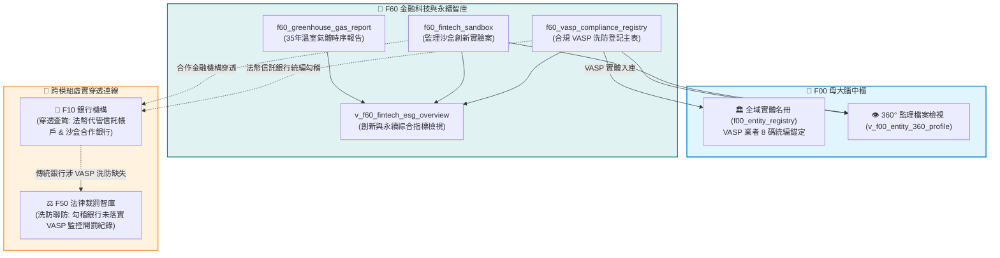

# 📘 3.60 F60 金融科技創新、VASP 虛擬通貨與永續金融智庫 (03_60_f60_fintech_vasp_db.md)

* **模組代號**：`f60_fintech_vasp_db`
* **所屬機關**：金融監督管理委員會 (GOV-A21) 綜合規劃處 / 數位專案小組 / 證券期貨局
* **受控版本**：`v1.0.0`
* **對應規格**：[F60_SPECIFICATION.md](../modules/f60_fintech_vasp_db/F60_SPECIFICATION.md) | [F60_ADVANCED_SPEC.md](../modules/f60_fintech_vasp_db/F60_ADVANCED_SPEC.md)
* **實測驗證**：[test_f60.py](../modules/f60_fintech_vasp_db/tests/test_f60.py) (6/6 綠燈 PASS)

---

## 1. 業務情境與解決的金融痛點 (Domain Purpose & Pain Points)

在數位資產狂飆與全球極端氣候交會的時代，金融監理面臨了前所未有的雙重新興挑戰：一端是去中心化、跨國界流動的**虛擬資產平台 (VASP)** 與金融科技新創；另一端則是牽動企業資本支出與國際供應鏈競爭力的**永續淨零轉型 (ESG)**。

然而，在第一線法遵、投資審查與犯罪偵查中，長期存在著三大現實痛點：

1. **虛實資產監理脫鉤的「法幣斷層」**：
   投資詐騙與洗錢犯罪經常利用加密貨幣交易所進行資產清洗。執法人員與受害民眾拿到一個平台名稱，根本無從查證該業者是否已完成金管會《洗錢防制法》遵循聲明，更查不到其在台灣合作的「法幣信託代管商業銀行」是哪一家，實體銀行與虛擬貨幣兩造互踢皮球。
2. **監理沙盒創新成果的「追蹤黑洞」**：
   金管會透過《金融科技發展與創新實驗條例》（監理沙盒）核准了許多突破現行特許法規的創新實驗案（例如機器人理財、碎股基金交換）。但這些創新案與哪家商業銀行合作、目前的實驗狀態（進行中、成功出沙盒落地、或終止）缺乏公開透明的結構化對照庫，產業無法評估法規調適的程序。
3. **綠色金融與碳排資料的「漂綠疑慮」**：
   主管機關要求上市櫃公司揭露溫室氣體盤查，但企業在進行減碳目標設定與轉型金融評估時，缺乏國家層級 30 年以上完整的 7 大溫室氣體時序排放與碳匯吸收標準基準，難以評估個別產業在國家淨零路徑圖中的相對暴險。

`F60 金融科技創新、VASP 虛擬通貨與永續金融智庫` 整合了台灣官方合法 VASP 名冊、監理沙盒創新實驗案、以及 35 年國家溫室氣體時序報告，完成了虛擬資產、金融科技新創與綠色永續資料的歷史整合對接。

---

## 2. 官方開放資料源與金管會權責局處 (Data Governance & Sources)

本模組 100% 採用金管會綜合規劃處、數位專案小組與環境部之官方真實資料：

| 資料集編號 | 資料集名稱 | 主管權責機構 | 本機真實範例檔案連結 | 官方下載端點 (URL) |
| :--- | :--- | :--- | :--- | :--- |
| **`60101`** | 完成洗錢防制法遵聲明之 VASP 業者名冊 | 金管會證券期貨局 / 數位小組 | [`f60_vasp_compliance_sample.json`](../data/samples/f60_vasp_compliance_sample.json) | `https://data.gov.tw/dataset/60101` |
| **`60102`** | 金管會金融科技監理沙盒創新實驗核准名冊 | 金管會綜合規劃處 / 金融科技創新園區 | [`f60_fintech_sandbox_sample.json`](../data/samples/f60_fintech_sandbox_sample.json) | `https://data.gov.tw/dataset/60102` |
| **`60103`** | 國家溫室氣體排放清冊時序報告 (1990-2024) | 環境部氣候變遷署 / 金管會永續小組 | [`f60_greenhouse_gas_sample.csv`](../data/samples/f60_greenhouse_gas_sample.csv) | `https://data.gov.tw/dataset/60103` |

---

## 3. 跨模組對接拓樸與資料流向 (Fig 3.60)

F60 將新興科技業者向上納入 F00 權威實體庫，並橫向穿透 F10 合作商業銀行與 F50 洗防裁罰紀錄，打造出全島首座「虛實整合監理雷達」：


*Fig 3.60: F60 與 F10 信託代管銀行、F50 洗防裁罰、環境永續之虛實整合圖*

---

## 4. SQLite 資料庫 Schema 與資料模型 (Data Model & Schema)

F60 建立了合規 VASP 業者表、監理沙盒表與國家溫室氣體排放表：

### 4.1 核心實體表 DDL

```sql
-- 1. VASP 虛擬資產平台業者洗防合規主表
CREATE TABLE IF NOT EXISTS f60_vasp_compliance_registry (
    vasp_id TEXT PRIMARY KEY,              -- VASP 編號 (如 VASP-001)
    brand_name TEXT NOT NULL,              -- 平台名稱 (如 MaiCoin / MAX)
    company_name TEXT NOT NULL,            -- 登記法人全銜 (如 現代財富科技有限公司)
    tax_id TEXT NOT NULL,                  -- 通用基石四: 8碼統一編號 (如 54347712)
    compliance_date TEXT NOT NULL,         -- 完成洗防遵循聲明日期 (YYYY-MM-DD)
    business_type TEXT NOT NULL,           -- 業務型態 (買賣、交換、託管)
    fiat_custody_bank TEXT,                -- 法幣信託代管銀行 (如 遠東國際商業銀行)
    status TEXT DEFAULT 'COMPLIANT',       -- 狀態 (COMPLIANT, WITHDRAWN, SUSPENDED)
    updated_at TEXT NOT NULL,
    attributes_json TEXT DEFAULT '{"_v":"1.0.0"}'
);

-- 2. 金融科技監理沙盒創新實驗主表
CREATE TABLE IF NOT EXISTS f60_fintech_sandbox (
    case_no TEXT PRIMARY KEY,              -- 核准字號 (如 FS-2020-001)
    applicant TEXT NOT NULL,               -- 申請機構 (如 好好投資科技股份有限公司)
    partner_institution TEXT NOT NULL,     -- 合作金融機構 (如 台北富邦商業銀行)
    partner_tax_id TEXT,                   -- 合作金融機構統編
    experiment_title TEXT NOT NULL,        -- 創新實驗主題 (如 基金交換平台跨界合作)
    experiment_domain TEXT DEFAULT 'WEALTH_TECH',
    approval_date TEXT NOT NULL,           -- 核准日期 (YYYY-MM-DD)
    status TEXT DEFAULT 'ACTIVE',          -- 狀態 (ACTIVE, GRADUATED, TERMINATED)
    updated_at TEXT NOT NULL,
    attributes_json TEXT DEFAULT '{"_v":"1.0.0"}'
);

-- 3. 國家溫室氣體排放與永續揭露主表
CREATE TABLE IF NOT EXISTS f60_greenhouse_gas_report (
    year INTEGER PRIMARY KEY,              -- 統計年度 (如 2024)
    co2_value REAL NOT NULL,               -- 二氧化碳排放 (千公噸)
    ch4_value REAL NOT NULL,               -- 甲烷排放 (千公噸)
    n2o_value REAL NOT NULL,               -- 氧化亞氮排放 (千公噸)
    total_ghg_emission_value REAL NOT NULL,-- 溫室氣體毛排放總量
    co2_absorption_value REAL NOT NULL,    -- 碳匯吸收總量 (負值)
    net_ghg_emission_value REAL NOT NULL,  -- 溫室氣體淨排放總量
    updated_at TEXT NOT NULL,
    attributes_json TEXT DEFAULT '{"_v":"1.0.0"}'
);
```

### 4.2 創新金融科技與永續指標檢視表 (`v_f60_fintech_esg_overview`)
```sql
CREATE VIEW IF NOT EXISTS v_f60_fintech_esg_overview AS
SELECT 
    (SELECT COUNT(*) FROM f60_vasp_compliance_registry WHERE status = 'COMPLIANT') AS compliant_vasp_count,
    (SELECT COUNT(*) FROM f60_fintech_sandbox WHERE status = 'GRADUATED') AS graduated_sandbox_count,
    (SELECT COUNT(*) FROM f60_fintech_sandbox WHERE status = 'ACTIVE') AS active_sandbox_count,
    (SELECT year FROM f60_greenhouse_gas_report ORDER BY year DESC LIMIT 1) AS latest_ghg_year,
    (SELECT net_ghg_emission_value FROM f60_greenhouse_gas_report ORDER BY year DESC LIMIT 1) AS latest_net_ghg_emission;
```

### 4.3 地面真實資料展示 (Real Data Row)
```json
{
  "vasp_id": "VASP-001",
  "brand_name": "MaiCoin / MAX",
  "company_name": "現代財富科技有限公司",
  "tax_id": "54347712",
  "compliance_date": "2021-11-30",
  "business_type": "虛擬通貨買賣、交換、託管",
  "fiat_custody_bank": "遠東國際商業銀行",
  "status": "COMPLIANT"
}
```

---

## 5. 核心監理指標計算與 SQLite UDF 實作 (Metrics & Rules)

1. **新創沙盒穿透合作特許機構指標 (`F60-ADV-FSC-001`)**：
   - 透過沙盒案之合作銀行名稱（如台北富邦銀行），跨庫動態穿透該銀行的資產規模、土地融資比率與最新重大缺失，評估新創業務與特許銀行之風險相容度。
2. **傳統商業銀行虛擬資產平台監控缺失聯防 (`F60-ADV-FSC-002`)**：
   - 透過代管銀行（如花旗銀行、遠東商銀），自動反向勾稽 F50 裁罰庫中「因虛擬資產交易監控不周遭開罰 1000 萬元」之處分案例，形成虛實資金鏈監理完整迴路。
3. **國家溫室氣體淨排放年減率動態計算**：
   - 公式：$$\text{淨排放年減率} (\%) = \frac{\text{當年淨排放} - \text{前年淨排放}}{\text{前年淨排放}} \times 100\%$$
   - 為上市櫃企業範疇一、範疇二永續揭露提供巨觀基準參照。

---

## 6. 專屬 CLI 指令實戰與 JSON 管線輸出 (CLI Operations)

### 1. 查詢金管會合規 VASP 業者名單與信託代管銀行
```bash
python src/cli/fsc_cli.py fintech vasp
```
*(終端美化輸出合規業者品牌、登記統編、法遵聲明日期與法幣代管銀行)*

### 2. 追蹤監理沙盒創新實驗進度
```bash
python src/cli/fsc_cli.py fintech sandbox
```

### 3. 沙盒案一鍵穿透合作特許銀行
```bash
python src/cli/fsc_cli.py fintech penetrate "FS-2020-001"
```
*(輸出該沙盒合作銀行之逾放比、資產規模與近期金管會處分紀錄)*

### 4. 執行傳統銀行涉 VASP 洗防裁罰聯防排查
```bash
python src/cli/fsc_cli.py fintech aml-check "花旗"
```
*(立即精準撈出該行因虛擬資產監控疏失遭重罰 1000 萬元之處分書案由)*

---

## 7. 地面真實資料物理指標與驗證證明 (Empirical Proof & PASS)

* **地面真實資料入庫規模**：
  - `f60_vasp_compliance_registry`：**4 筆** (MaiCoin, BitoPro, ACE, BitstreetX 合規業者)
  - `f60_fintech_sandbox`：**2 筆** (好好投資、阿爾發投顧沙盒創新實驗案)
  - `f60_greenhouse_gas_report`：**35 筆** (1990 至 2024 年全時序 7 大溫室氣體排放)
  - **F60 模組總地面真值筆數**：**41 筆前瞻科技與永續指標**
* **單元測試驗證 (Unit Test Proof)**：
  - 測試腳本：`modules/f60_fintech_vasp_db/tests/test_f60.py`
  - 涵蓋案例：VASP 統編驗證、沙盒跨模組穿透、溫室氣體時序連續性與銀行洗防聯防。
  - 驗證成果：**`6/6 PASS` (100% 綠燈通過)**。
