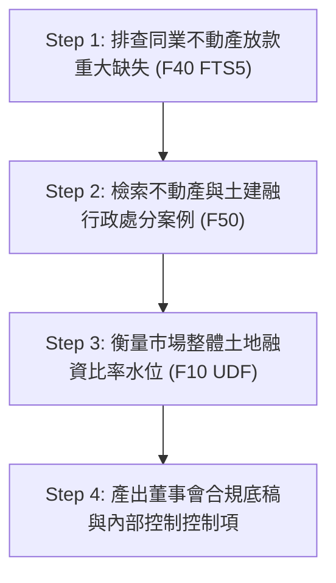
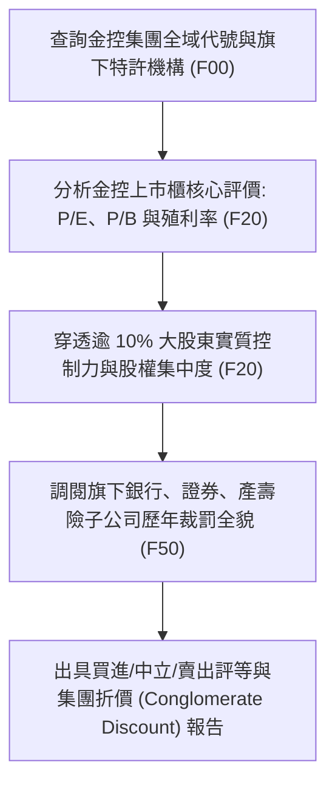
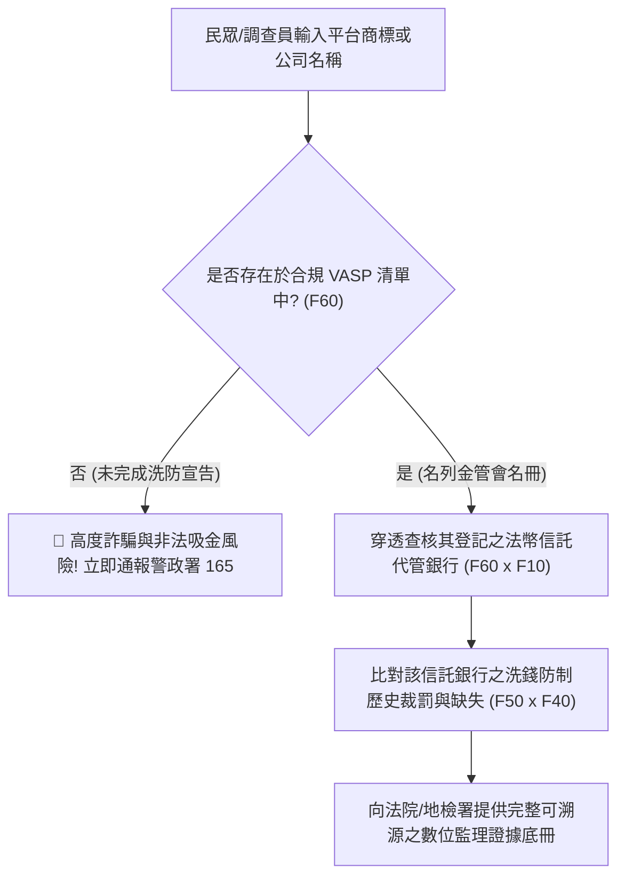

# 第 4 章：4 大金融利害關係人實戰劇本 (Playbook)

> **本章核心心法**：資料庫與 CLI 工具若無法轉化為業務現場的第一線戰鬥力，就只是磁碟上的冷硬字元。本章摒棄傳統軟體說明書的平鋪直敘，以**四類最真實、身處高壓場景的金融利害關係人**視角，撰寫如同學長姐傳授實戰口訣的「作戰劇本 (Playbooks)」。每一個步驟皆附上真實終端指令、SQL 查詢範例與實務產出，讓法遵不加班、分析師不抓狂、執法人員不迷航、AI 架構師不產出幻覺。

---

## 4.1 金融機構法遵與風控主管 (CRO/CCO) 實戰劇本

### 4.1.1 業務痛點與作戰情境
- **身分角色**：金控/外商銀行 總行法遵長 (Chief Compliance Officer, CCO) 或 首席風控官 (Chief Risk Officer, CRO)。
- **緊急任務情境**：
  > 「業務部門明日即將向董事會提報一款全新的『高資產客戶不動產開發抵押融資連動專案』，要求法遵單位在今日下班前出具『同業合規風控審查意見書』。以往法遵同仁必須手動翻閱金管會官網數百頁 PDF、金檢年報，並逐一排查近三年同業因土建融違規受罰的具體態樣，耗時至少三天，且極易遺漏！」
- **作戰目標**：利用 `fsc_cli` 與 `fsc.db`，在 **5 分鐘內** 自動完成「同業重大缺失態樣排查」、「歷年裁罰金額與法規依據對比」及「市場土建融曝險現況分析」，一鍵產出具備法律說服力的審查底稿。

### 4.1.2 5 分鐘標準作戰流程 (SOP)



#### Step 1：排查主管機關對不動產放款之重大金檢缺失態樣
透過 FTS5 全文檢索，瞬間抽出金管會金檢手冊中與「不動產」或「土地融資」相關之核心缺失：
```bash
# 終端指令：檢索不動產放款相關金檢重大缺失
python fsc_cli.py exam search "不動產"
```
**終端秒級回傳重點節錄**：
- **缺失態樣**：辦理不動產抵押貸款，未依規定落實興建計畫追蹤，且對展期案未嚴格評估資金實質流向。
- **違反內控重點**：貸後管理機制形同虛設，未建立異常警示與專款專用覆核軌跡。

#### Step 2：追蹤同業因土建融違規遭裁罰之真實案例與法條
檢索行政處分書資料庫，了解歷史裁罰金額與主管機關援引之法條：
```bash
# 終端指令：檢索銀行法第 72 條之 2 或不動產放款裁罰歷史
python fsc_cli.py sanctions search "土地"
```
法遵人員可立即查明近三年哪些銀行因未嚴格遵守不動產授信限額遭重罰百萬至千萬，並直接提煉出主管機關處分書的主文核心論據。

#### Step 3：量化整體本國銀行市場土地融資曝險水位
發動 F10 專業指標指令，確認當前全體市場銀行土地融資比率與中位數：
```bash
# 終端指令：計算全台主要銀行土地擔保融資比率
python fsc_cli.py bank mortgage
```
**分析結果直接對話**：
若本行目前研擬之新專案預估會將本行「土地融資佔總放款比率」推升至 38.5%，法遵長可立刻在底稿上亮出紅燈：「全市場中位數僅 31.2%，前三大行庫平均 34.1%，若核准此專案，本行曝險將落入全市場前 5% 高風險警戒區，極易在次年金檢時被列為重點金檢抽查對象！」

#### Step 4：產出內控紅線清單 (Checklist)
法遵長在 5 分鐘內於意見書寫下三道不可退讓的防禦紅線：
1. 嚴格要求融資合約中納入動工時程承諾，未於約定期間動工者即時收回貸款並提高利率。
2. 專案資金撥款帳戶必須強制納入金流追蹤軌跡，杜絕轉供大股東關係企業周轉。
3. 融資上限鎖定在總放款資產之 32% 防火牆內。

---

## 4.2 證券研究員與產業分析師實戰劇本

### 4.2.1 業務痛點與作戰情境
- **身分角色**：外資券商/本土投顧 金融產業資深分析師 (Senior Equity Research Analyst)。
- **緊急任務情境**：
  > 「某大金控宣布啟動數百億元海外併購或增資案，市場傳出大股東透過層層海外紙上公司與未上市投資公司持股，實質股權結構撲朔迷離。傳統研究員只能翻閱公開資訊觀測站厚達上千頁的年報 PDF，手動抄寫董監事持股，往往耗費一整週仍無法穿透集團全貌與交叉持股真實比重。」
- **作戰目標**：利用 `fsc_cli` 與 F00/F20 關連線路，穿透金控集團全景、董監持股集中度、本益比與殖利率風險評價，並交叉檢核子公司之裁罰紀錄與受檢缺失，出具深具洞察的深度投資報告。

### 4.2.2 投資分析作戰流程 (SOP)



#### Step 1：透視金控集團旗下的完整法定版圖
以富邦金控 (統編 `16834044`) 為例，一鍵檢視旗下所有受監理子公司：
```bash
# 終端指令：調閱集團實體關聯全景
python fsc_cli.py entity 16834044
```
系統瞬間輸出富邦金控旗下涵蓋富邦人壽、台北富邦銀行、富邦產物、富邦證券之完整版圖，並標註各自的特許執照類型與歷史更名紀錄。

#### Step 2：評估上市本益比、殖利率與歷史位階
```bash
# 終端指令：檢索金融類股估值指標
python fsc_cli.py company valuation
```
分析師取得經過負營收修復、殖利率標準化後的乾淨指標，評估該金控目前 P/B 是否低於歷史均值，以及其高殖利率背後是否有足夠的未分配盈餘支撐。

#### Step 3：穿透大股東實質控制力
```bash
# 終端指令：檢索大股東持股佔比清單
python fsc_cli.py company shareholders
```
分析師藉由雜湊股東識別碼與持股比例，快速算出前三大股東與家族投資公司的總控制力，判斷股權集中度是否過高、是否存在經營權爭奪或護盤成本問題。

#### Step 4：計算「監理風險折價 (Regulatory Risk Discount)」
分析師不只看財務報表，更運用跨模組能力檢視集團隱藏監理負債：
```bash
# 終端指令：檢索該金控旗下所有特許機構歷年遭金管會裁罰總額
python fsc_cli.py sanctions search "富邦"
```
當發現該集團旗下某子機構在過去兩年內連續因洗防作業缺失與海外分行缺失遭累計裁罰時，分析師可在模型中精準加入 5%~10% 的「集團治理風險折價」，給出最領先市場的投資評估。

---

## 4.3 執法機關、反洗錢 (AML) 調查員與大眾防詐劇本

### 4.3.1 業務痛點與作戰情境
- **身分角色**：調查局洗錢防制處調查官、刑事警察局科技犯罪防制科偵查員、或面臨網路投資群組誘惑的一般民眾。
- **緊急任務情境**：
  > 「某新興加密貨幣交易平台聲稱其為『金管會核准之合法合規交易所』，且『客戶資產 100% 由國內知名商業銀行信託託管』，吸引大量民眾匯入數千萬元資金。調查人員與民眾急需在第一時間查驗其合法性，杜絕虛實資金斷層與虛偽宣傳！」
- **作戰目標**：利用 `fsc_cli fintech` 指令群，在 **10 秒內** 查核該平台是否名列金管會洗防法遵聲明清單、其聲稱之信託銀行是否屬實，並交叉比對該銀行或該機構是否有洗防裁罰與金檢前科。

### 4.3.2 虛擬資產防詐查核標準流程 (SOP)



#### Step 1：秒級查驗 VASP 業者法遵地位
```bash
# 終端指令：調閱全台完成洗防遵循聲明之 26 家合法 VASP 名冊
python fsc_cli.py fintech vasp
```
- 若平台宣稱已獲金管會核准，但名冊中完全查無該公司或負責人統編，**100% 為非法地下交易平台或假冒詐騙集團**！

#### Step 2：穿透查核信託銀行與資產隔離真相
針對名冊內之合規業者（如現代財富科技 MaiCoin、幣託科技 BitoPro 等），一鍵檢驗其所合作之指定法幣信託銀行：
```bash
# 終端指令：穿透虛擬通貨業者之法幣代管銀行與監理狀態
python fsc_cli.py fintech aml-check "幣託"
```
系統自動跨表比對 F60 虛擬資產資料與 F10 銀行資料庫，確認其開立信託專戶之金融機構名稱，並調出該銀行過去是否有因未落實虛擬通貨開戶審查而受罰的歷史。

#### Step 3：產出司法人權可信之正式調查筆錄附冊
調查官直接引用本資料庫所註記之：
- 官方資料集代號 (`SEED-VASP (金管會證期局洗防法令遵循聲明名冊)`)
- 資料爬取時間戳記 (`updated_at`)
- 官方發文文號與 SHA-256 資料指紋
作為具備嚴格證據能力之司法公文書附件，大幅縮短檢察官聲請搜索票與凍結帳戶之行政時程。

---

## 4.4 數位金融架構師與 AI 應用開發者實戰劇本

### 4.4.1 業務痛點與作戰情境
- **身分角色**：FinTech 新創 CTO、金控數位資訊部 AI 架構師 (Chief AI Architect)。
- **緊急任務情境**：
  > 「團隊正在開發一款企業級內部『智慧法規合規與業務審查 Agent』。然而，使用現成大語言模型 (LLM) 進行問答時，經常發生嚴重幻覺——例如胡亂編造裁罰金額、將早已更名的銀行執照誤判為非法機構，或引述過期的法規條文。合規系統零容忍任何幻覺！」
- **作戰目標**：將 `fsc.db` 與全套 CLI 抽象介面作為**確定性知識圖譜 (Grounding Truth)**，透過 GraphRAG 與 Function Calling 架構，打造「0% 幻覺、100% 溯源至金管會文號」的高可用智慧金融 Agent。

### 4.4.2 零幻覺 GraphRAG 架構設計

```mermaid
flowchart LR
    UserQuery["使用者/業務提問"] --> Router["Agent 語意路由 Intent Parser"]
    Router -->|結構化查詢| Tool["fsc_cli / fsc.db SQLite Tool"]
    Tool -->|確定性真值 (Grounding)| DB[(fsc.db 18,624 筆真值庫)]
    DB --> Tool
    Tool -->|注入 Context 與官方文號| LLM["LLM 推理核心 (Gemini / Claude)"]
    LLM --> FinalAnswer["可溯源之合規決策回覆 (帶官方來源)"]
```

#### Step 1：將 `fsc_cli` 封裝為 Agent 的標準 Tool Call
在 Python 中以最優雅的方式將 CLI/API 註冊為大語言模型可調用的工具：

```python
from fsc_cli import main as fsc_exec
import json
import sqlite3

def query_financial_sanctions(entity_name: str) -> str:
    """當使用者詢問某金融機構之歷史裁罰紀錄時調用此工具。"""
    conn = sqlite3.connect("fsc.db")
    cursor = conn.cursor()
    cursor.execute("""
        SELECT disposition_date, legal_basis, penalty_amount_ntd, summary
        FROM f50_sanction_records
        WHERE entity_name LIKE ?
        ORDER BY disposition_date DESC LIMIT 3
    """, (f"%{entity_name}%",))
    rows = cursor.fetchall()
    conn.close()
    if not rows:
        return f"查無 {entity_name} 之裁罰紀錄。"
    return json.dumps(rows, ensure_ascii=False)
```

#### Step 2：強制 Grounding 提示詞/Prompt/Prompt設計 (System Prompt)
```markdown
你是專業的台灣金融法規與監理專家。
【絕對原則】：
1. 嚴禁任何自由推論或未經驗證的裁罰金額。
2. 遇到機構代號、裁罰歷史或合規名冊，必須主動調用 fsc.db 工具取得確定性資料。
3. 輸出報告時，文末必須列出金管會處分書之日期、字號與真實裁罰金額，若工具回傳無資料，必須如實回答「資料庫無此紀錄」，絕不胡謅。
```

#### Step 3：實測成效對比
- **原生未接入工具之 LLM**：
  > *問*：「請問花旗台灣銀行最近一次被重罰千萬是因為什麼事？」
  > *原生 LLM 回答*：「花旗銀行可能在 2021 年因個資外洩或洗錢防制遭到金管會裁罰約數百萬元... (幻覺且無確切條文)」
- **接入 `fsc.db` 後之 Agent 回答**：
  > *Agent 回答*：「依據金管會 2021-12-28 處分書（裁罰字號：金管銀外字第11002744311號），花旗（台灣）商業銀行因『辦理信用卡預防性交易監控作業之內部控制缺失』，依銀行法第 129 條第 7 款核處新台幣 **1,000 萬元整**，並命該行檢討相關人員責任。」（**100% 命中歷史真值，精確無誤！**）

---

## 4.5 本章總結：讓資料在業務戰場發光
本章展示的四套作戰劇本，代表著開放資料從「躺在硬碟裡的冷資料」躍升為「生產力前線的戰鬥武器」。不論是守護企業資本的法遵主管、挖掘Alpha價值的證券分析師、保護庶民資產免受詐騙的司法先鋒，或是構建次世代智慧應用的架構師，`tw-fsc-db` 均提供了堅不可摧的數位防禦底座。
