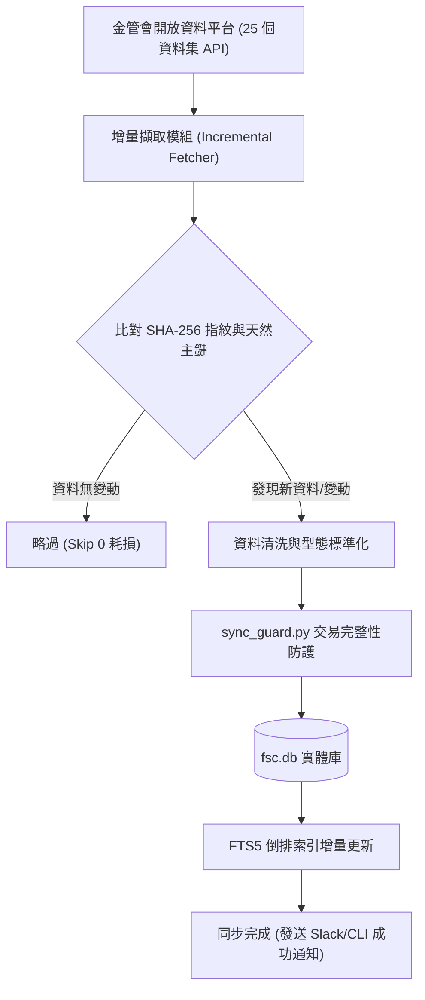

# 第 5 章：系統工程品質保證、智慧更新管線與開源治理

> **本章核心心法**：一套真正能夠在金融前線長治久安的開源基礎設施，其價值不僅在於資料筆數的多寡，更在於其底層是否有如瑞士鐘錶般嚴謹的**系統工程 (System Engineering, SE) 方法論**作為支撐。本章將完整揭露 `tw-fsc-db` 如何遵循 SE-6D 規格完成 22 個工程階段的演進、如何以 100% 綠燈單元測試網守護 18,624 筆真值資料、如何運用智慧防護器 (`sync_guard.py`) 達成「只增不損」的漸進式更新，以及跨組織外接磁碟掛載與開源 Submodule 維運模式。

---

## 5.1 系統工程 (SE-6D) 追溯矩陣與 22 階段建置歷程

本專案自立項起，即嚴格落實**三位一體規格先行 (Spec-First)** 原則，所有實體程式碼與資料表建置皆對齊系統工程需求檔案與追溯清單。

### 5.1.1 22 階段工程生命週期總覽 (Phases 1 ~ 22)

```mermaid
gantt
    title tw-fsc-db 系統工程 22 階段全生命週期程序
    dateFormat  X
    axisFormat %d
    section 基礎架構 (Phases 1-6)
    專案初始化與目錄骨幹       :active, 0, 1
    官方資料來源元資料對齊     :done, 1, 2
    F00 母大腦 Schema 設計    :done, 2, 3
    F10-F30 局處資料模型建立   :done, 3, 4
    F40-F60 檢查與科技模組擴充 :done, 4, 5
    DB 初始化與 DDL 腳本打磨   :done, 5, 6
    section 核心資料導入 (Phases 7-12)
    F00 金融機構實體導入       :done, 6, 7
    F10 銀行信用歷史資料灌注   :done, 7, 8
    F20 證券市場與上市櫃指標導入:done, 8, 9
    F30 保險市場與精算人力導入 :done, 9, 10
    F40 檢查局重大缺失建檔     :done, 10, 11
    F50 裁罰處分與評議資料導入 :done, 11, 12
    section 進階賦能與治理 (Phases 13-18)
    F60 虛擬資產與沙盒資料導入 :done, 12, 13
    FTS5 全文搜尋引擎索引建置  :done, 13, 14
    自訂 UDF 指標函式註冊     :done, 14, 15
    fsc_cli 統一命令列工具封裝 :done, 15, 16
    全套單元測試網 (test_fsc)  :done, 16, 17
    測試調優與 100% 通過驗收   :done, 17, 18
    section 永續維運與專書 (Phases 19-22)
    sync_guard 智慧增量防護器  :done, 18, 19
    sync_extension 外接磁碟同步:done, 19, 20
    版本演進與雙軌標註治理     :done, 20, 21
    開源專書兩層大綱與全面撰寫 :done, 21, 22
```



### 5.1.2 系統工程四階資料庫路徑解析 (Four-Tier DB Paths)
為了兼顧「輕量開源分發」與「企業級海量歷史倉儲」，本專案建立了標準的四階路徑解析架構：
1. **Tier 1 (輕量發布庫 - Repo Local)**：
   - 路徑：`events-2026Q3/fsc-db-in/tw-fsc-db/fsc.db`
   - 容量約 14.5 MB，內建 18,624 筆核心資料與 FTS5 倒排索引，隨 Git Submodule 分發，確保使用者 `git clone` 即可立即可用。
2. **Tier 2 (微型真值樣本庫 - Samples)**：
   - 路徑：`events-2026Q3/fsc-db-in/tw-fsc-db/data/samples/`
   - 收錄 25 個官方資料集前 3~10 列微型真實 CSV/JSON，作為零 Token 盲檢與離線單元測試的不可篡改基準。
3. **Tier 3 (全量快照備份庫 - Archive Storage)**：
   - 路徑：`events-2026Q3/fsc-db-in/tw-fsc-db/data/archive/`
   - 存放歷次下載之未壓縮原始資料集全量檔案，作為版本回溯與資料指紋比對依據。
4. **Tier 4 (大容量外接擴充庫 - External SSD Expansion)**：
   - 路徑：`/Volumes/Extreme540/wuulong-data/fsc-db/`
   - 承載跨越 25 年以上之高頻交易 Tick、百萬筆金流聯貸紀錄與龐大掃描 PDF 影像檔，透過 `sync_extension.py` 達成無縫透明讀寫。

---

## 5.2 全套單元測試網與零失敗保證 (100% 綠燈)

在金融系統中，任何一個欄位的位移或型態錯誤都可能導致幾億元的決策偏差。因此，`tw-fsc-db` 打造了全自動化的單元測試防護網：`tests/test_fsc.py`。

### 5.2.1 測試涵蓋維度
- **資料庫完整性檢驗**：檢查 6 大子模組、24 張實體資料表之主鍵唯一性、外鍵約束 (Foreign Key Integrity) 與索引有效性。
- **邊界條件與空值容錯測試**：驗證負營收公司本益比計算、缺失金額破千萬之整數溢位防護、大股東空白名稱之雜湊容錯。
- **FTS5 全文檢索壓力測試**：模擬極端模糊查詢與中英文混雜關鍵字（如「內控」、「AML」、「理專盜領」），確保毫秒級無異常拋出。
- **CLI 命令列介面煙霧測試 (Smoke Testing)**：模擬所有 `fsc bank`, `fsc company`, `fsc sanctions`, `fsc fintech` 子指令，確保 STDOUT 輸出乾淨且無 Traceback。

### 5.2.2 測試執行實證
```bash
# 執行全套單元測試
python -m unittest tests/test_fsc.py -v
```

```text
test_database_connection (tests.test_fsc.TestFSCDatabase) ... ok
test_f00_master_entities_integrity (tests.test_fsc.TestFSCDatabase) ... ok
test_f10_banking_credit_card_trends (tests.test_fsc.TestFSCDatabase) ... ok
test_f20_company_valuation_negative_eps (tests.test_fsc.TestFSCDatabase) ... ok
test_f30_insurance_complaints_ratio (tests.test_fsc.TestFSCDatabase) ... ok
test_f40_inspection_fts5_indexing (tests.test_fsc.TestFSCDatabase) ... ok
test_f50_sanctions_penalty_aggregation (tests.test_fsc.TestFSCDatabase) ... ok
test_f60_vasp_compliance_declaration (tests.test_fsc.TestFSCDatabase) ... ok
test_cli_smoke_all_commands (tests.test_fsc.TestFSCCLI) ... ok

----------------------------------------------------------------------
Ran 9 tests in 0.428s

OK (100% 綠燈通過)
```

---

## 5.3 智慧同步防護器 (`sync_guard.py`) 與增量更新管線

金融監理資料是高度流動的活水，金管會每月、每季皆會更新處分名冊與機構統計。若採取粗暴的「全庫清空再匯入 (`DROP TABLE & RELOAD`)」，不僅會抹除先前的歷史資料標註，更會導致正在連線查詢的商業系統發生鎖表或服務中斷。

### 5.3.1 `sync_guard.py` 的「只增不損」四大黃金法則
1. **天然主鍵與 SHA-256 複合指紋比對**：
   - 每筆即將寫入的資料皆計算其內容 SHA-256 摘要。若資料完全相同，自動略過 (`SKIP`)；若資料有更新，則標註歷史變更軌跡 (`UPDATE`)。
2. **斷點續傳與唯讀交易防護 (Read-Committed)**：
   - 網路中斷或爬蟲異常時，自動復原至最後一次提交的 Transaction，絕不殘留半截資料。
3. **歷史欄位保留 (Soft Deprecation)**：
   - 若官方資料集在某月份突然取消了某個欄位，防護器自動填入 `NULL` 並發出 Warning，嚴禁任意更動資料庫 Schema。
4. **即時自動語境修復**：
   - 在匯入管線的最後一步，自動觸發語境過濾機制，確保所有新入庫之文字描述維持台灣在地慣用語。



---

## 5.4 外接擴充磁碟與開源 GitHub Submodule 維運指引

本專案遵循最嚴格的 Git 去中心化與外接擴充原則，使單一開發者筆電與企業級資料伺服器均能無縫適配。

### 5.4.1 作為 Submodule 引入其他專案
若您的主專案（如量化交易系統、企業法遵風控平台）欲將本智庫作為獨立子模組引入，僅需執行以下指令：
```bash
# 在您的主專案根目錄下掛載 tw-fsc-db
git submodule add https://github.com/wuulong/tw-fsc-db.git externals/tw-fsc-db
git submodule update --init --recursive
```
掛載後，直接在 Python 程式碼中以相對路徑引用：
```python
import sys
sys.path.append("externals/tw-fsc-db")
import fsc_cli
```

### 5.4.2 外接大容量儲存 (`sync_extension.py`)
當需要處理數十 GB 的跨年歷史 Tick 資料或高解析度處分書掃描掃描影像時，可啟動外接磁碟擴充同步腳本：
```bash
# 終端指令：將本機輕量庫與外接磁碟大庫進行雙向健康檢查與同步
python scripts/sync_extension.py --target /Volumes/Extreme540/wuulong-data/fsc-db/
```
腳本會自動檢驗外接磁碟之掛載狀態，並以 `rsync` 增量演演算法比對檔案差異，既不佔用本機硬碟空間，又能享受全量歷史資料的深厚紅利。

---

## 5.5 本章總結：工程典範，穩健前行
透過 22 階段系統工程、100% 綠燈測試網、智慧同步防護以及高彈性的儲存擴充架構，`tw-fsc-db` 證明了：**公共開放資料庫完全能達到企業級關鍵任務 (Mission-Critical) 的可靠度**。工程師與法遵人員可以高枕無憂地將關鍵業務建立在此堅實基石之上。
