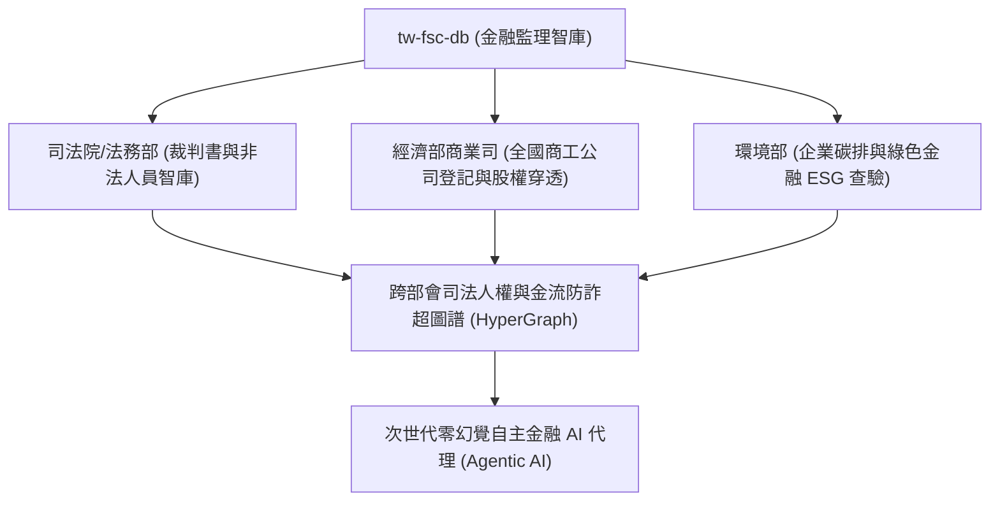

# 第 6 章：結語與未來路線圖 (Roadmap)

> **本章核心心法**：技術的終極價值，永遠在於增進人類社會的福祉與公平。金融監理資料的開源化，絕非僅是一場技術極客的狂歡，而是推動台灣金融體制「從黑盒子走向透明陽光、從資訊不對稱走向資料平權」的歷史性轉捩點。

---

## 6.1 結語：讓金融監理資料走出黑盒子

長久以來，台灣金融市場存在著一道無形的數位高牆。
大金控、大型跨國投行擁有昂貴的彭博終端機、專門的法遵智囊團與巨額預算，能夠在第一時間嗅出主管機關的監理風向與同業處分底牌；然而，一般中小型企業、新創團隊、基層消費者與遭詐騙的庶民大眾，卻只能在主管機關零散、排版不一、甚至動輒 404 找不到網頁的官方網站間疲於奔命。

`tw-fsc-db`（台灣金融監督管理委員會開源智庫）的誕生，正是為打破這道高牆而生：
1. **打破格式藩籬**：將 25 個官方斷裂的 CSV、JSON 與 PDF 處分書，鍛造成 18,624 筆乾淨、具備天然主鍵與外鍵關聯的單一 SQLite 資料庫 (`fsc.db`)。
2. **消弭搜尋門檻**：透過 FTS5 倒排索引引擎，讓原本需要人工翻閱數天的金檢缺失與裁罰案例，縮短為 0.05 秒的終端指令。
3. **透視隱形控制**：建立 F00 金融實體全景，讓跨越銀行、保險、證券的金控帝國與大股東持股網路無所遁形。
4. **守護數位正義**：建立合規 VASP 穿透機制與信託銀行關聯查核，為執法人員與民眾打造抵禦虛擬資產吸金詐騙的最堅強數位盾牌。

這不僅僅是程式碼的勝利，更是台灣開源社群對「金融民主化」與「資料平權」的崇高實踐。

---

## 6.2 未來藍圖：從金管會邁向跨部會司法人權與綠色金融大一統網路

`tw-fsc-db` 只是整體台灣數位治理與政府資料大一統工程的一塊重要拼圖。展望未來，我們將依據以下三大維度推進跨領域的超級大聯防網路：

### 1. 跨部會「司法裁判與金融處分」深度穿透 (FSC x MOJ)
- 與司法院裁判書系統、法務部行政執行署串接，將金管會的行政處分書（F50）與法院刑事詐欺判決書、民事侵權賠償進行雙向連結。
- 當某不肖理專因盜領客戶資金被撤銷執照後，系統能跨庫警示其在司法民刑事判決中的訴訟狀態，徹底杜絕金融罪犯換個招牌繼續騙。

### 2. 「商工登記與大股東多層穿透」實體對照整合 (FSC x MOEA)
- 與經濟部全國商工登記資料庫聯手，打破僅揭露前 10% 大股東的限制。透過圖演演算法，向外穿透至境內外投資公司、家族信託基金與人頭帳戶，真正繪製出台灣財閥與政治獻金背後的「終極受益人 (Ultimate Beneficial Owner, UBO)」真實拓樸圖。

### 3. 「永續金融與環境正義」資料完整迴路 (FSC x MOENV)
- 深化 F60 綠色金融模組，將台灣 35 年溫室氣體排放時序，細緻對齊至 2,000 餘家上市櫃公司的溫室氣體範疇一、範疇二與範疇三盤查資料。
- 協助台灣企業在面對歐盟 CBAM 碳關稅與金管會「綠色金融行動方案 3.0」時，擁有立即可查、具備國際公信力的開源碳揭露基底。

---

## 6.3 寫給每一位開源協作者的話
「開源的力量不在於完美的起步，而在於持續的共創與守護。」
我們竭誠歡迎全台灣的金融從業人員、資料科學家、法律專家、獨立記者與熱心公民一同加入這項計畫。無論是回報一個欄位勘誤、貢獻一段 SQL 分析範例，或是撰寫一條新的 CLI 指令，您都在為台灣金融環境的透明與健全，刻下一道深遠的印記！
